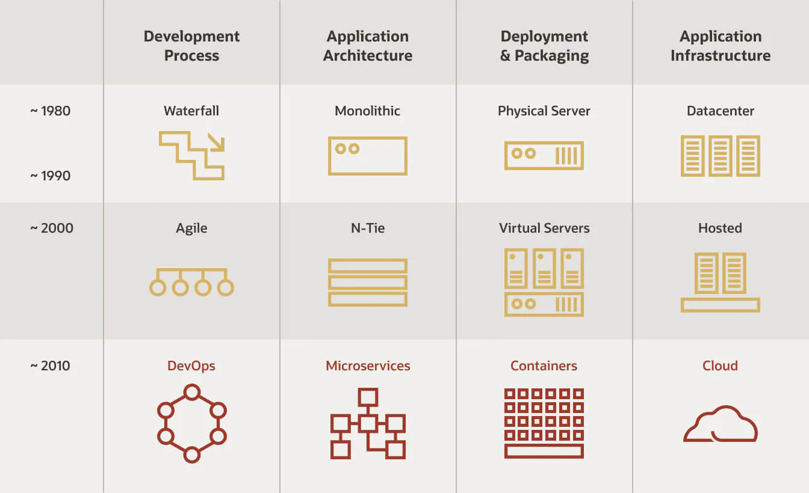

<style>
.burk {
    background-color: red;
    color: yellow;
    display:inline-block;
}
</style>

# 01 DevOps와 CI/CD

- DevOps와 CI/CD
- Cloud Native Application
- CI/CD 작업 흐름
- Jenkins

## 1. DevOps와 CI/CD
- Waterfall vs Agile
  - 
  - Agile: 형식을 최소화, 계획의 최소화
> Manifesto for Agile Software Development(애자일 선언문)
> - We are uncovering better ways of developing software by doing it and helping others do it.
> Through this work we have come to value:
>   - Individuals and interactions over processes and tools
>   - Working software over comprehensive documentation
>   - Customer collaboration over contract negotiation
>   - Responding to change over following a plan
>   
> That is, while there is value in the items on
> the right, we value the items on the left more.”

### Waterfall vs Agile vs DevOps
https://www.oracle.com/kr/cloud/cloud-native/what-is-cloud-native/
http://agilemanifesto.org/iso/en/manifesto.html
- 


### Cloud Native Architecture
https://docs.microsoft.com/ko-kr/dotnet/architecture/cloud-native/definition

간단한 정의

  - 클라우드 네이티브 아키텍처 및 기술은 클라우드에서 빌드되고 클라우드 컴퓨팅 모델을 최대한 활용하는 워크로드를 디자인, 생성 및 운영하는 접근 방식입니다.

클라우드 네이티브 컴퓨팅 재단은 공식 정의

  - 클라우드 네이티브 기술을 통해 조직은 퍼블릭, 프라이빗 및 하이브리드 클라우드와 같은 최신 동적 환경에서 확장 가능한 애플리케이션을 빌드하고 실행할 수 있습니다. 컨테이너, 서비스 메시, 마이크로 서비스, 변경할 수 없는 인프라 및 선언적 API는 이 접근 방식을 예로 들 수 있습니다.

  - 이러한 기술을 사용하면 복원력, 관리 가능 및 관찰 가능한 느슨하게 결합된 시스템을 사용할 수 있습니다. 강력한 자동화와 결합되어 엔지니어는 최소한의 수고로 자주 예측 가능하게 높은 영향을 미치는 변경을 할 수 있습니다.

## 2. Cloud Native Application

### Cloud Native Application
- 
- MSA
- Containers
- DevOps
- CI/CD

### Cloud Native - MSA
2018 가트너
- 

### Cloud Native - Containerization
- 

  ```
  Cloud Native - Containerization
  Host OS
  Docker Engine
  Bins/Libs
  App1
  Bins/Libs
  App1
  Container 1 Container 2
  - Dev
  - UAT
  - Production
  ```
### Cloud Native - DevOps
2007~2008년 IT 운영 및 SW 개발에 문제점 대두
- 개발과 배포가 다른 조직에서 관리 (다른 목표를 가짐)

2009년 Belgium에서 첫 DevOps 컨퍼런스 ==>
- Development + Operations
- 인프라로 코드 관리 (Mark Burgess and Luke Kanies)
- 애자일 인프라 스트럭쳐 (Andrew Shafer)
- 애자일 시스템 관리 운동 (Patrick Debois)
- Lean Startup (Eric Ries)
- 지속적인 통합 및 배포 운동 à CI, CD

- 

### Cloud Native - DevOps    

- 엔지니어가, 프로그래밍하고, 빌드하고, 직접 시스템에 배포 및 서비스를 RUN
- 사용자와 끊임없이 Interaction하면서 서비스를 개선해 나가는 일련의 과정, 문화
- 

### Cloud Native - DevOps
- 


## 3. CI/CD 작업 흐름

### Cloud Native - CI/CD
- CI(Continuous Integration)?
  - 1991
  - 작은 단위 여러번, 자주
  - 코드 품질 향상
- CD(Continuous Delivery)?
- CD(Continuous Deployment)?
- 
  - vcs, scm : git
    - gitlab은 로컬에 직접 설치
- [지속적 통합이란 무엇입니까?](https://aws.amazon.com/ko/devops/continuous-integration/)


### What is Continuous Integration?
- 

### CI/CD Flow

- 
  - NCP: Naver cloud

### Deploy on Docker using Jenkins

- war
- 만들어진 소스

### Deploy on Kubernetes
```shell
Code Push
Continuous Build Continuous Delivery Deployment
Image Build/Push
Analysis Reports
Image Pull

```
- 

### Continuous Integration (CI)

- 코드가 Commit 되었다는 가정에서 시작
- 이미지 생성 ==> 저장소 저장
- 스케줄링: jenkins 에서 관리해서 쿠버에 배포

### Continuous Delivery (CD)


### Deploy on EC2/VM


## 4. Jenkins
### Jenkins
지속적인 통합과 배포 à Work flow를 제어
- Continuous Integration Server
  - Continuous Development, Build, Test, Deploy
다양한 Plugins 연동
- Build Plugins: Maven, Ant, Gradle …
- VCS Plugins: Git, SVN …
- Languages Plugins: Java, Python, Node.js …


### Jenkins
Top 5 CI/CD tools
- jenkins, circleci, TeamCity, Bamboo, GitLab
- 

### Jenkins Pipeline


### Install Jenkins
[jenkins 다운로드](https://www.jenkins.io/download/)

https://hub.docker.com/r/jenkins/jenkins
https://github.com/jenkinsci/docker/blob/master/README.md
```shell
# 이방식으로 수행했음
$ docker run -d -p 8088:8080 -p 50000:50000 --name jenkins-server \
--restart=on-failure \
-v "d:/Docker/vloumn/jenkins_home":/var/jenkins_home \
-v "d:/Docker/vloumn/jenkins":/home \
jenkins/jenkins:lts-jdk11
```
```shell
#이미지 다운로드
docker pull jenkins/jenkins

#Jenkins 실행
docker run -d -p 8080:8080 -p 50000:50000 --name jenkins-server --restart=on-failure jenkins/jenkins:lts-jdk11

docker run -d -p 8080:8080 -p 50000:50000 --name jenkins-server --restart=on-failure -v jenkins_home:/var/jenkins_home jenkins/jenkins:lts-jdk11
```


Check the init password

1. http://localhost:8088
2. 주어진 폴더의 Password 입력:    (unlock password)
   - $ cat /var/jenkins_home/secrets/initialAdminPassword 
3. Default 모드로 jenkins 설치
   - 
- Jenkins 설정
- JDK  (Dashboard>   Jenkins 관리 >   Global Tool Configuration)
  - 
- item 이란
  - Jenkins의 빌드의 최소 단위
### Exercise #1 Jenkins Job 1/2
docker 상태 확인
```shell
$ docker ps
CONTAINER ID   IMAGE                       COMMAND                  CREATED          STATUS          PORTS                                              NAMES
1f958086b3b6   jenkins/jenkins:lts-jdk11   "/usr/bin/tini -- /u…"   16 minutes ago   Up 14 minutes   0.0.0.0:50000->50000/tcp, 0.0.0.0:8088->8080/tcp   jenkins-server


# 로그 확인
$ docker logs jenkins-server
Running from: /usr/share/jenkins/jenkins.war
webroot: EnvVars.masterEnvVars.get("JENKINS_HOME")
2022-12-29 06:49:24.317+0000 [id=1]     INFO    winstone.Logger#logInternal: Beginning extraction from war file
2022-12-29 06:49:25.146+0000 [id=1]     WARNING o.e.j.s.handler.ContextHandler#setContextPath: Empty contextPath
```

Item name :My-First-Project
- Freestyle project
- Build > Execute shell
- Save
Build Now
        

```shell
Building in workspace /var/jenkins_home/workspace/My-First-Project 폴더 확인

$ docker exec -it jenkins-server bash
jenkins@1f958086b3b6:/$ cd /var/jenkins_home/workspace/My-First-Project
jenkins@1f958086b3b6:~/workspace/My-First-Project$ ls
jenkins@1f958086b3b6:~/workspace/My-First-Project$ ls


```
### 후속 강의 소개
- Spring Cloud로 개발하는 마이크로서비스 애플리케이션
- Jenkins를 이용한 CI/CD Pipeline 구축
- Microservice Architecture와 Patterns
- Spring Boot와 WebFlux를 이용한 Reactive RESTful API 개발