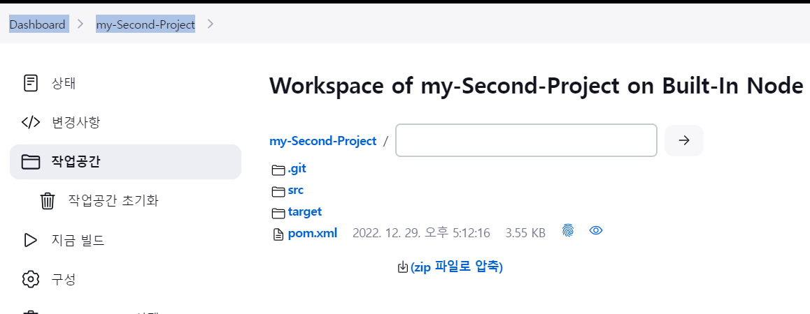
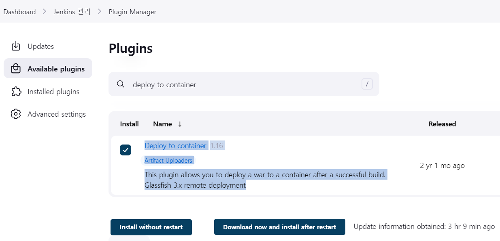
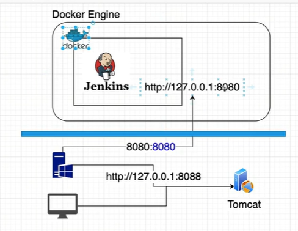
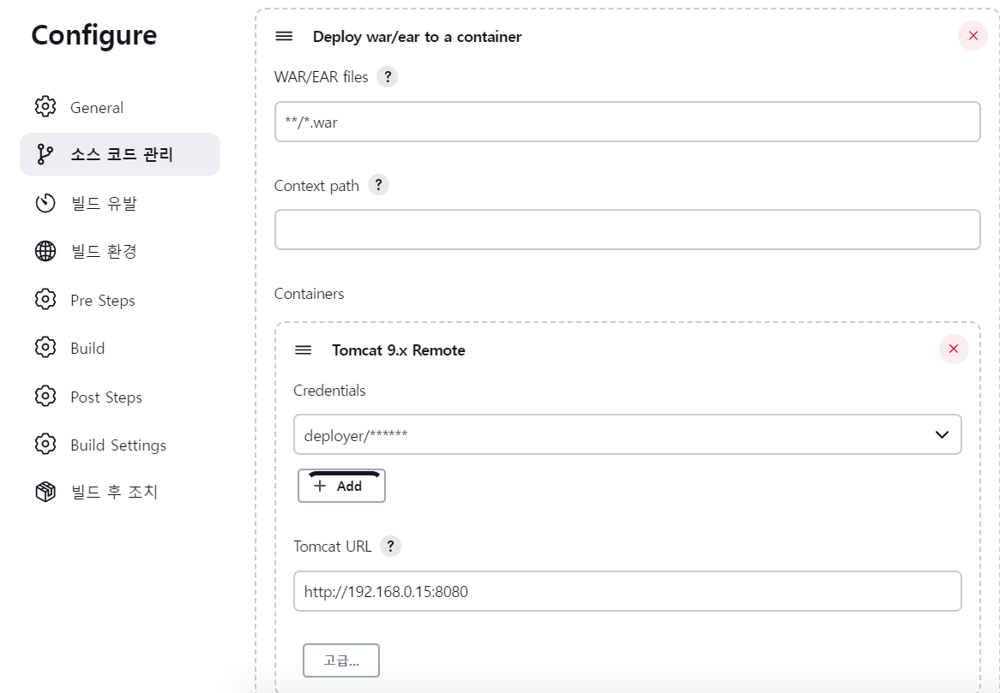
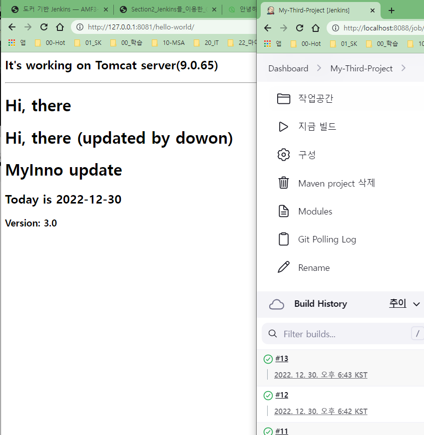
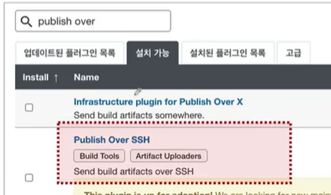
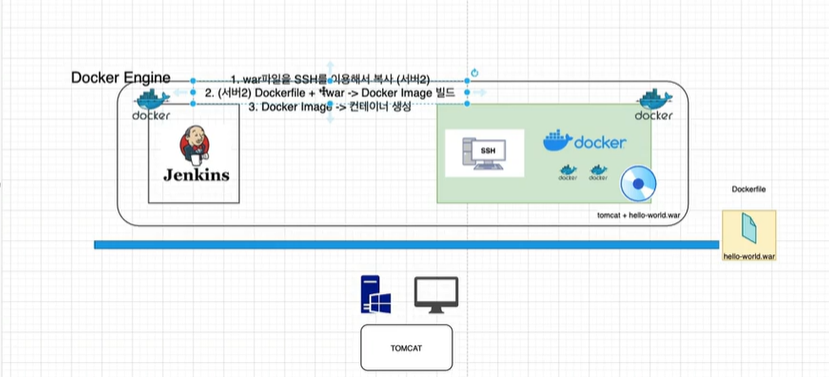
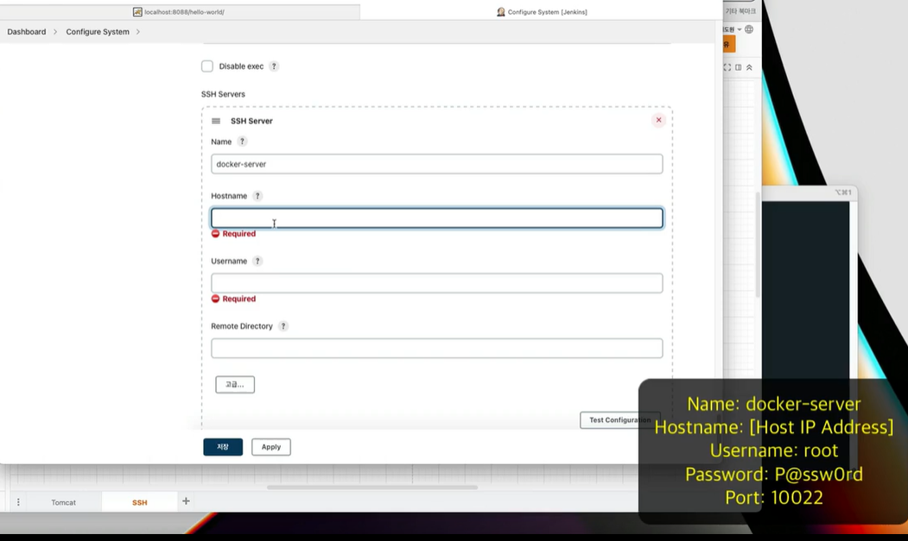
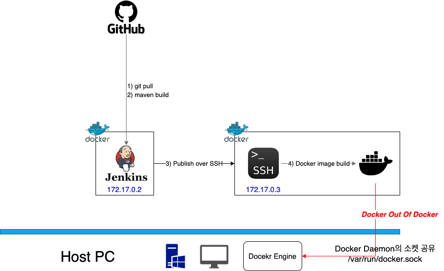

<style>
.burk {
    background-color: red;
    color: yellow;
    display:inline-block;
}
</style>

# 02 Jenkins를 이용한 CI/CD Pipeline 구축

- CI/CD를 위한 Git & Maven 연동
- CI/CD를 위한 Tomcat Server 연동
- PollSCM 설정
- Docker를 이용한 실습 환경 구성

## 1. CI/CD를 위한 Git & Maven 연동

### Setup Git plugin
Manage Jenkins > Jenkins Plugins > Installed plugin > github
- GitHub plugin: 버전1.36.0    이미 설치 되어 있음
Manage Jenkins > Global Tool Configuration > git
- docker의 터미널에서 got 명령어가 정상 실행되는지 확인
  ```shell
  jenkins@1f958086b3b6:~/workspace/My-First-Project$ git --version
  git version 2.30.2
  ```

### Setup Maven plugin
Manage Jenkins > Jenkins Plugins > available > maven
- Maven IntegrationVersion:  3.20  설치


### my-Second-Project

작업 공간 확인
-  Dashboard >  my-Second-Project > 작업 공간
- 

설치 로그 확인
  ```shell
  jenkins@1f958086b3b6:~/workspace/my-Second-Project/target$ pwd
  /var/jenkins_home/workspace/my-Second-Project/target
  jenkins@1f958086b3b6:~/workspace/my-Second-Project/target$ ls
  classes  generated-sources  generated-test-sources  hello-world  hello-world.war  maven-archiver  maven-status  surefire-reports  test-classes
  jenkins@1f958086b3b6:~/workspace/my-Second-Project/target$ ls -l | grep war
  -rw-r--r-- 1 jenkins jenkins 8025927 Dec 29 08:13 hello-world.war
  ```

## 2. CI/CD를 위한 Tomcat Server 연동
Manage Jenkins > Jenkins Plugins > available > deploy to container plugin

```shell
Deploy to containerVersion
1.16
Artifact Uploaders
This plugin allows you to deploy a war to a container after a successful build.
Glassfish 3.x remote deployment
```

- 
- 설치 
  - 이전에 생성한 war 파일을 tomcat 서버에 배포하기 위한 plugin

### Exercise #3 Jenkins Job
Item name : My-Third-Project
- Maven project

General
- Deploy the Second project on Tomcat

Source Code Management
- Repository URL
  https://github.com/joneconsulting/cicd-web-project

Build
- Root POM: pom.xml
- Golds: clean compile package

Post-build Actions
- Deploy war/ear to a container
- **/*.war


§ Post-build Actions
- Container: Tomcat 9.x Remote


Post-build Actions
- Credentials: deployer
- Tomcat URL: http://192.168.0.8:8080/




- IP로 오류가 발생하여 IP 수정
  - Tomcat URL: "http://host.docker.internal:8081"
  - 만약 docker PC가 아닌 다른 서버이면 어떻게 할까?

### tomcat 설치
. 9버전 설치
. bin/startup.bat ==> 기동 확인
. bin/shutdown.bat 
. 포트 변경
conf/server.xml     : 8080 --> 8081
  ```
  <Connector port="8088" protocol="HTTP/1.1"
  connectionTimeout="20000"
  redirectPort="8443" />
  ```
-  d:\APP\apache-tomcat-9.0.70\webapps\manager\META-INF\context.xml
  -  'context.xml'해당 파일 2군데 있음 디렉토리 주의
    ```shell
  
    주석처리
    <!--
      <Valve className="org.apache.catalina.valves.RemoteAddrValve"
             allow="127\.\d+\.\d+\.\d+|::1|0:0:0:0:0:0:0:1" />
    /-->
    ```

- role 수정
  -  d:\APP\apache-tomcat-9.0.70\conf\tomcat-users.xml
  ```shell
    <role rolename="manager-gui"/>
    <role rolename="manager-script"/>
    <role rolename="manager-jmx"/>
    <role rolename="manager-status"/>
    <user username="admin" password="admin" roles="manager-gui,manager-script, manager-jmx, manager-status"/>
    <user username="deployer" password="deployer" roles="manager-script"/>
    <user username="tomcat" password="tomcat" roles="manager-gui"/>
  ```
## 3. PollSCM 설정
소스 변경시 자동 배포  or 일정 간격으로
Project > Configure > Build Triggers
- Build periodically > cron job   : 일정 간격(소스 변경 없어도)
- Poll SCM > cron job  (소스 변경이 있을때만)
- 


소스 코드 수정
1. https://github.com/joneconsulting/cicd-web-project  fork
   - https://github.com/myinno/edu-cicd-web-project.git
2. 소스 수정
    ```shell
    git add .
    git commit -m "커밋한 내용 설명"
    git push
    ```
3. 일정 시간 경과후 확인    
   -  


## 4. SSH + Docker가 설치되어 있는 VM(컨테이너) 사용하기 (Updated)
Jenkins에서 만들어진 결과를 **다른 서버**에 배포하는 방법

1. plugin 설치(ssh)
   - Manage Jenkins > Jenkins Plugins > available > publish over ssh
   - Publish Over SSH
   - 
      
2. Setup Publish Over Plugin
   - Manage Jenkins > Configure System > Publish over SSH
     - Add SSH Servers
       - Name: docker-host
       - Hostname: [Remote IP] ex)192.168.0.8
       - Username: root
       - Passphrase/Password: P@ssw0rd
       - Port: 10022
     - Test Configuration
3. SSH  기능을 하는 도커 설정
   - 

   1. ssh 서버 jenkins에 등록
      - 
   2. ssh 도커 서버 기동(강의 제공)
       ```shell
       $ cd "d:\Docker\vloumn\UbuntuSshd"
       $ docker-compose up -d 
       $ ssh -p 10022 root@localhost   
       ```
   3. ssh 서버 접속 기록은 "~/.ssh/known_hosts에 기록됨" 
4. jenkins에 ssh 설정
    ```shell
    Dashboard > Jenkins 관리 > Configure System
    SSH Servers  추가
    
    Name: docker-server
    Hostname: 192.168.0.15 (해당 Winddow 서버의 IP, localhost을 등록하면 jenlkins 서버를 지징함)
    Username: root
    Remote Directory: .
    
    
    ==> Test Connection (Success)
    ```
5. 1
```shell

```
6. 1
```shell

```
7. 1
```shell

```
8. 1
```shell

```
9.  1
```shell

```
### SSH Docker 기동
1. 참고 (교안 내용)
    ```shell
    
    - Windows) SSH 서버 (with 도커) 실행 명령어 (방법1)
      - docker run --privileged --name docker-server -itd -p 10022:22 -p 8081:8080 -e container=docker -v /sys/fs/cgroup:/sys/fs/cgroup edowon0623/docker:latest /usr/sbin/init
    - Windows) SSH 서버 (with 도커) 실행 명령어 (방법2, 위 명령어로 실행되지 않을 경우)
      - docker run -itd --name docker-server -p 10022:22 -e container=docker --tmpfs /run --tmpfs /tmp -v /sys/fs/cgroup:/sys/fs/cgroup:ro -v /var/run/docker.sock:/var/run/docker.sock edowon0623/docker:latest /usr/sbin/init
    - MacOS intel chip) SSH 서버 (with 도커) 실행 명령어
      - docker run --privileged --name docker-server -itd -p 10022:22 -p 8081:8080 -e container=docker -v /sys/fs/cgroup:/sys/fs/cgroup edowon0623/docker:latest /usr/sbin/init
    - MacOS apple silicon chip, m1) SSH 서버 (with 도커) 실행 명령어
      - docker run --privileged --name docker-server -itd -p 10022:22 -p 8081:8080 -e container=docker -v /sys/fs/cgroup:/sys/fs/cgroup:rw --cgroupns=host edowon0623/docker-server:m1 /usr/sbin/init
    ```

   - Windows 환경에서 Docker in Docker 방식으로 SSH+Docker 컨테이너가 기동되지 않을 때는 아래와 같이, Docker Out Of Docker 방식으로 기동해 보시기 바랍니다.
     -   
2. ubuntu sshd Docker 생성
   - [참고원본](https://kamang-it.tistory.com/entry/DockerUbuntuSshd-%EC%9A%B0%EB%B6%84%ED%88%AC-%EC%BB%A8%ED%85%8C%EC%9D%B4%EB%84%88-%EC%8B%A4%ED%96%89%ED%95%98%EA%B3%A0-%EC%9B%90%EA%B2%A9%EC%A0%91%EC%86%8D%ED%95%98%EA%B8%B0ssh)

   - UbuntuSshd/Dockerfile
     ```shell
     FROM ubuntu:latest
     MAINTAINER myinno
     RUN apt-get update
     RUN apt-get install -y openssh-server
     RUN mkdir /var/run/sshd
  
     #set password
     RUN echo 'root:root' |chpasswd
  
     #replace sshd_config
     #sed는 replace시켜주는 구문인데 PermitRootLogin과 yes로, UsePAM을 주석처리하는 것이다.
     RUN sed -ri 's/^#?PermitRootLogin\s+.*/PermitRootLogin yes/' /etc/ssh/sshd_config
     RUN sed -ri 's/UsePAM yes/#UsePAM yes/g' /etc/ssh/sshd_config
  
     #make .ssh
     RUN mkdir /root/.ssh
  
     RUN apt-get clean && \
         rm -rf /var/lib/apt/lists/* /tmp/* /var/tmp/*
  
     EXPOSE 22
  
     CMD ["/usr/sbin/sshd", "-D"]
  
     ```
   - docker-compose.yaml
     ```shell
     version: '1.0'
  
     services:
       mysshserver:
         build: UbuntuSshd
         container_name: myubuntu
         command: /usr/sbin/sshd -D
         ports:
           - '10022:22'
         expose:
           - '10022'
     ```
   - 기동
     ```shell
     # docker 기동
     $ docker-compose up
  
     #ssh 접속 테스트
     #root의 비번은 root임
     $ ssh -p 10022 root@localhost
     ```
## 4. Docker를 이용한 실습 환경 구성
