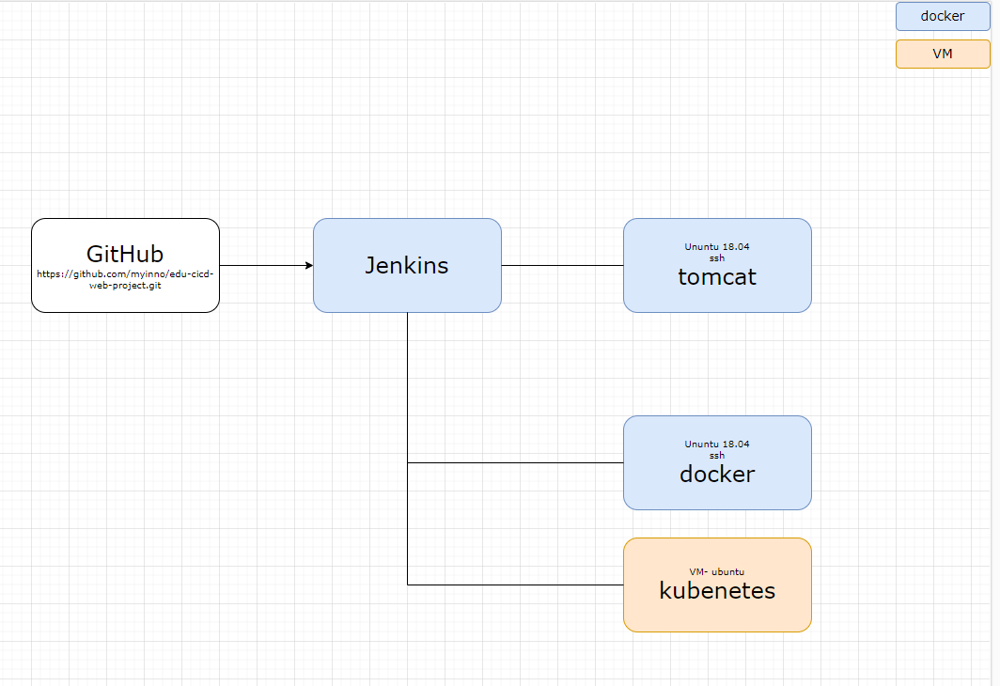
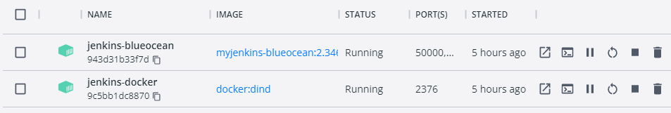
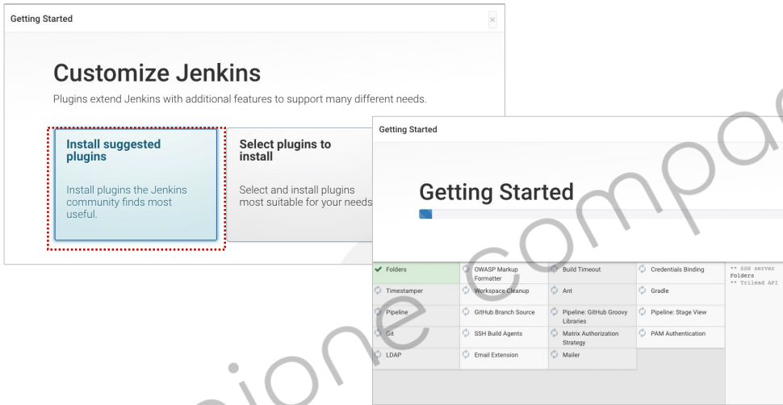
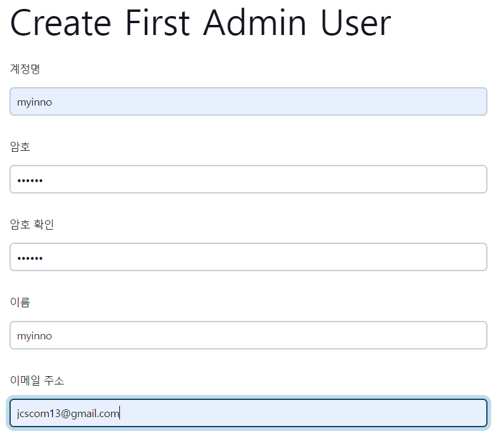

<style>
.burk {
    background-color: red;
    color: yellow;
    display:inline-block;
}
</style>


# A01-도커 기반 Jenkins
- 도커 기반 Jenkins 설정
- 주요 참조 문서
  - https://www.jenkins.io/doc/tutorials/build-a-java-app-with-maven/
- 설치 환경:노트북, window10
- <span class=burk>회사 네크워크 확경에서 발생하는 "x509" 오류는 "https://auth.docker.io"예외 등록 후 정상 처리됨</span>
  - 이수정(20009791@partner.....) 현장대리인에게 요청함
- 
- 정리문서 관리: https://github.com/msa-2023/inflearn-JenkinsCICD.git
## 1. Jenkins 서버 생성(개별 , 2. docker-compose로 실행 권고) 
이부분은 눈으로만 확인하고 (목차 2. Jenkins 환경구성(docker-compose)로 이도 )

Docker기반으로 Jenkins 설정 ( )
- 원본참조: https://www.jenkins.io/doc/book/installing/docker/
- 이 부분은 실행하지 않아도 됨 (2번에서 docker-compose로 수행함)

1. Docker에서 브리지 네트워크 만들기
    - Jenkins을 실행하는 도커에서 다른(ex:Maven)등을 Docker기반으로 동작하기 위하여
    - 2개의 Docker 이미지간 통신을 위한 네트워크 설정
    ```bash
    # 생성 스크립트
    docker network create jenkins
    ```
    ```bash
    # (참고)삭제 스크립트
    docker network rm jenkins
    # 리스트
    docker network ls
    ```
2. docker:dind Docker 이미지 실행
   - Pipeline상에서 Maven등을 별도 설치하지 않고 Docker로 실행할떄 이용하는 도커
   - "docker:dind"의 자세한 내용은 아래 참조
   - 아래 명령어는 cmd창에서 실행(^)

        ```bash
        docker run --name jenkins-docker --rm --detach ^
          --privileged --network jenkins --network-alias docker ^
          --env DOCKER_TLS_CERTDIR=/certs ^
          --volume jenkins-docker-certs:/certs/client ^
          --volume jenkins-data:/var/jenkins_home ^
          --publish 2376:2376 ^
          docker:dind
        ```
   - <span class=burk>실행후 Docker의 "Environment"  </span>
     - DOCKER_TLS_CERTDIR: /certs  확인 필요
     - git bash 창에서 수행하면 "C:/Program Files/Git/certs"로 설정됨
     - 왜 설정이 안되는지는 확인 안됨

3. Jenkins Docker 생성
   - Dockerfile (d:\APP\@inflearn\202212-JenkinsCICD\환경구성\jenkins\Dockerfile)
        ```bash
        FROM jenkins/jenkins:2.346.3-jdk11
        USER root
        RUN apt-get update && apt-get install -y lsb-release
        RUN curl -fsSLo /usr/share/keyrings/docker-archive-keyring.asc \
        https://download.docker.com/linux/debian/gpg
        RUN echo "deb [arch=$(dpkg --print-architecture) \
        signed-by=/usr/share/keyrings/docker-archive-keyring.asc] \
        https://download.docker.com/linux/debian \
        $(lsb_release -cs) stable" > /etc/apt/sources.list.d/docker.list
        RUN apt-get update && apt-get install -y docker-ce-cli
		    #Time Zone 변경
	      ENV TZ=Asia/Seoul
        RUN ln -snf /usr/share/zoneinfo/$TZ /etc/localtime && echo $TZ > /etc/timezone

        USER jenkins
        RUN jenkins-plugin-cli --plugins "blueocean:1.25.6 docker-workflow:1.29"
        ```
   - 새 도커 이미지를 빌드(Dockerfile이 있는 곳에서 실행)
     - 2023-01-03 회사 Network에서는 오류

         ```shell
         #10 1.992 Unable to retrieve JSON from https://updates.jenkins.io/update-center.json?version=2.346.3: PKIX path building failed: sun.security.provider.certpath.SunCertPathBuilderException: unable to find valid certification path to requested target
         #10 2.419 Error getting update center json
         ```
     ```bash
     docker build -t myjenkins-blueocean:2.346.3-1 .
     ```
4. 컨테이너로 자체 이미지를 실행(CMD창)
    - /home 에 추가 volumn 설정
      -   --volume "d:/APP/GIT-AMF3/jenkins":/home ^
      -   로컬 PC와 공유 목적
	  - "--env TZ=Asia/Seoul" 추가
    - CMD창에서 수행하지 않으면 'DOCKER_CERT_PATH' 설정이 다른 값으로 됨

       ```bash
        docker run --privileged -m 512m ^
        --name jenkins-blueocean --detach ^
        --network jenkins --env DOCKER_HOST=tcp://docker:2376 ^
        --env DOCKER_CERT_PATH=/certs/client --env DOCKER_TLS_VERIFY=1 ^
        --volume jenkins-data:/var/jenkins_home ^
        --volume jenkins-docker-certs:/certs/client ^
        --volume "d:\APP\@inflearn\202212-JenkinsCICD\jenkins_SHARE":/home ^
        --restart=on-failure ^
        --env JAVA_OPTS="-Dhudson.plugins.git.GitSCM.ALLOW_LOCAL_CHECKOUT=true" ^
        --env TZ=Asia/Seoul ^
        --publish 10022:22 ^
        --publish 8099:8080 --publish 50000:50000 ^
        myjenkins-blueocean:2.346.3-1
        ```

5. 2개의 Docker가 작동여부 확인(설치 완료)
    

    - 도커의 환경설정 정보 확인
    - 

## 2. Jenkins 환경구성(docker-compose)

### 2.1 파일 구조
- 환경설정에 추가한 내용
  - JENKINS_ROOT=d:\APP\@inflearn\202212-JenkinsCICD
  - ".env"파일에 docker-compose관련 환경변수 추가
 
      ```shell
      #centos에 적용한 내용
      # /home/myinno/inflearn-JenkinsCICD/envsystem/.env
      [myinno@localhost envsystem]$ cat .env
      DIRPATH=/home/myinno/inflearn-JenkinsCICD
      ```
- Root Dir: %JENKINS_ROOT%\envsystem\
- docker-compose-jenkins.yml
  - jenkins, ssh등 필요한 서버를 한번에 생성함
- jenkins/Dockerfile
  - jenkins 관련 dockerfile 
- UbuntuSshd/dockerfile
  - ubuntu+ssh + docker  (테스트 용)
- UbuntuSshd/Dockerfile-tomcat
  - DooD로 수행할 Tomcat서버 정보: A06에서 사용함

- 참고(centos)
  - windows의 "docker-compose"와 동일한 방법으로 linux에서 사용하기 위하여 alias 등록함

      ```shell
      alias docker-compose="docker compose"
      ```
  - Host가 Centos8에서 수행하면 "ssh-docker"의 build오류 발생
    - 'apt-get update에서 오류 발생'
      ```shell
      --------------------
        15 |     RUN dpkg --configure -a
        16 |     RUN apt-get clean
        17 | >>> RUN apt-get update
        18 |     #
        19 |     # SSH □□ġ
      --------------------
      ERROR: failed to solve: process "/bin/sh -c apt-get update" did not complete successfully: exit code: 100
      ```
    - 조치 내용 (https://stackoverflow.com/questions/38002543/apt-get-update-returned-a-non-zero-code-100)

      ```shell
      #FROM ubuntu:18.04
      FROM  ubuntu:focal-20211006
      ```


### 2.2 수행하기
1. 빌드
    ```shell
    $ cd /d/APP/@inflearn/202212-JenkinsCICD/envsystem 
     (linux)/home/myinno/inflearn-JenkinsCICD/envsystem
    $ docker-compose -f docker-compose-jenkins.yml build
    ```
2. Run
    ```shell
    $ docker-compose -f docker-compose-jenkins.yml up
    ```
3. ssh 확인 하기
    ```shell
    $ ssh -p 2202 root@localhost
    ```
   - jenkins 서버는 ssh 데몬이 미 실행중 ( '/usr/sbin/sshd -D' 실행 후 테스트)

   - docker 재 생성으로 ssh key 관련 오류가 발생하면 "c:\Users\Administrator\.ssh\known_hosts"파일 삭제 후 다시 수행 (docker 이미지가 다시 빌드되면 이전 서버의 ssh 관련 key값 변경으로 오류 발생)

4. docker 프로세스 확인
   - ssh로 접속하면 오류, 직접 terminal로 접속해서 테스트 
   - ssh-docker, jenkins-blueocean 에 대하여 테스트
    ```shell
    $ docker ps
    ```
   - 

### 2.3 Jenkins 설정

1. jenkins 접속: http://localhost:8099
   - 
2. 주어진 폴더의 Password 입력:    (unlock password)
   - $ cat /var/jenkins_home/secrets/initialAdminPassword
3. Default 모드로 jenkins 설치 (패키지가 설치되어야 함)
   -  
4. 기본 계정 정보 등록
   - 


## 3. 주요 SW 설치

## A.참고

1. Docker Hub 로그인 과정 로그(정상-테더링)
    ```console
    $ docker login -u jcscom13 -p ******** https://index.docker.io/v1/
    WARNING! Using --password via the CLI is insecure. Use --password-stdin.
    WARNING! Your password will be stored unencrypted in /var/jenkins_home/workspace/docker-push@tmp/1ad0eb9a-560b-41a9-9fe5-b8fb939c8b8c/config.json.
    Configure a credential helper to remove this warning. See
    https://docs.docker.com/engine/reference/commandline/login/#credentials-store

    Login Succeeded
    ```
2. 오류 내역(회사 네트워크)
    ```console
    $ docker login -u jcscom13 -p ******** https://index.docker.io/v1/
    WARNING! Using --password via the CLI is insecure. Use --password-stdin.
    Error response from daemon: Get "https://registry-1.docker.io/v2/": Get "https://auth.docker.io/token?account=jcscom13&client_id=docker&offline_token=true&service=registry.docker.io": x509: certificate signed by unknown authority
    [Pipeline] // withDockerRegistry
    ```
## B. 도커 컨테이너 안에서 도커 실행하기
-  https://m.blog.naver.com/PostView.naver?isHttpsRedirect=true&blogId=isc0304&logNo=222274955992
- 도커를 사용해 컨테이너에서 컨테이너를 실행하는 방법
- 

### B.1 Docker In Docker
DinD는 도커 컨테이너 내에서 도커 데몬을 추가로 동작시킵
- 실제 데몬을 동작시켜야 하기 때문에 도커 데몬에 추가 권한이 필요
- DinD 도커를 만들 때 명령을 살펴보면 --privileged를 사용해 추가 권한을 부여하는 명령이 포함
  ```shell
  $ docker run --privileged --name dind1 -d docker:20.10.5-dind
  ```

- hub.docker.com의 도커 컨테이너에서 이 기능을 포함한 이미지를 제공해 누구나 쉽게 구축해서 사용이 가능
- 도커 내의 모양을 확인하면 docker가 동작하는 모습을 확인
  ```shell
  $ docker exec -it dind1 sh
  / # ps
  PID   USER     TIME  COMMAND
  1 root      0:00 dockerd --host=unix:///var/run/docker.sock --host=tcp://0.0.0.0:2376 --tlsverify --tlscacert /certs/server/ca.pem --tlscert /certs/serv
  49 root      0:00 containerd --config /var/run/docker/containerd/containerd.toml --log-level info
  155 root      0:00 sh
  161 root      0:00 ps
  ```

- DinD 방식은 도커 안에 새로운 격리된 환경을 만들 수 있다는 장점이 있지만 **보안상의 문제**로 그리 추천되는 방식은 아닙
  - --privileged 옵션은 
    - Docker는 호스트의 모든 장치에 액세스하는 권한을 부여
    - AppArmor나 SELinux에서 일부 구성을 설정하여 컨테이너가 호스트의 컨테이너 외부에서 실행되는 프로세스와 거의 동일한 호스트 액세스를 허용
    - 간단히 얘기하면 컨테이너가 호스트 전체 권한을 갖는 치명적인 결함을 가집
    - 이 기능을 사용하려면 도커를 컨트롤하는 컨테이너가 호스트에 미칠 영향을 고려해야 합니다.
### B.2 Docker Out of Docker

DooD는 내부에 새로운 컨테이너 서비스를 만들지 않고 기존의 사용하던 컨테이너를 추가로 생성
- docker를 사용해보면 관리자 권한 없이 실행했을 때 /var/run/docker.sock에 대한 권한이 없다는 메시지를 자주 보셨을 겁니다. 
  - 이 파일이 로컬 시스템에서 도커 데몬과 통신할 수 있는 소켓 파일
  - sock 파일을 컨테이너와 공유하면 이 파일을 통해서 도커 명령을 수행
  ```shell
  $ docker run -it -v /var/run/docker.sock:/var/run/docker.sock docker
  ```
- 도커 명령을 실행하면 이 도커 명령은 호스트에서 실행중인 도커 데몬에게 전달됩
- 컨테이너 안에서도 외부 데몬을 사용하는 형태

- DinD 방식에 비해서 DooD 방식은 안전하느냐? 그렇진 않습니다.  
  - 공격을 하는 방향이 바뀔 뿐 막강한 권한을 갖는 것은 동일
  - 단적인 예로 -v 옵션을 사용하면 원격 호스트의 자원을 공유해 공격할 수 있습
  ```shell
  $ docker run -it -v /tmp:/tmp -v /etc/crontab:/etc/crontab --rm busybox sh
  ```
  - tmp와 crontab 파일을 공유하고 tmp 디렉토리에 백도어 파일을 하나 배치하고 crontab을 수정해 실행 예약을 걸어둔다면 호스트의 모든 통제권은 공격자에게 넘어갑니다. 
### B.3 컨테이너 관리를 활용한 서비스

DinD 방식과 DooD 방식은 보안성의 문제가 있음에도 불구하고 컨테이너가 컨테이너를 컨트롤할 수 있는 것은 큰 장점이 있습
- 컨테이너 안에서 개발을 진행하면서도 쿠버네티스처럼 컨테이너가 컨테이너를 관리한다던지, 
- 구름 IDE처럼 컨테이너를 동적으로 생성해 사용자에게 서비스를 제공한다던지
- 클라우드 서비스처럼 사용자 요청에 따라 컨테이너를 동적으로 배치해 서버리스 서비스를 제공하는 등의 다양한 작업이 가능합니다.


- 완전히 별도의 가상환경을 만들 때는 DinD, 
- 가상화된 환경을 다같이 다루고 싶다면 DooD를 선택하시면 됩니다.

## C. 주요 설정 파일

###   docker-compose-jenkins.yml
```yaml
version: '2'

services:
  jenkins-blueocean:
    build: jenkins
    mem_limit: 1024m
    mem_reservation: 600m
    privileged: true
    networks:
      - jenkins
    networks:
      default:
        aliases:
          - docker
    ports:
      - 8099:8080
      - 2201:22
      - 50000:50000
    environment:
      - DOCKER_HOST=tcp://docker:2376
      - DOCKER_CERT_PATH=/certs/client
      - DOCKER_TLS_VERIFY=1
      - JAVA_OPTS="-Dhudson.plugins.git.GitSCM.ALLOW_LOCAL_CHECKOUT=true"
      #      - JAVA_OPTS="-Xmx700m"
      - TZ=Asia/Seoul
    volumes:
      - /d/APP/@inflearn/202212-JenkinsCICD/jenkins_SHARE/certs:/certs/client
      - /d/APP/@inflearn/202212-JenkinsCICD/jenkins_SHARE/var:/var/jenkins_home
      - /d/APP/@inflearn/202212-JenkinsCICD/jenkins_SHARE/home:/home
  #    restart: on-failure
  #### D
  jenkins-docker:
    image: docker:dind
    mem_limit: 100m
    mem_reservation: 60m
    privileged: true
    #    detach: true
    #    rm: true
    volumes:
      - /d/APP/@inflearn/202212-JenkinsCICD/jenkins_SHARE/certs:/certs/client
      - /d/APP/@inflearn/202212-JenkinsCICD/jenkins_SHARE/var:/var/jenkins_home
    ports:
      - 2376:2376
    networks:
      - jenkins
    networks:
      default:
        aliases:
          - docker
    environment:
      - DOCKER_TLS_CERTDIR=/certs

  ## docker + SSH + Ubuntu
  ssh-docker:
    build: UbuntuSshd
    container_name: ssh-docker
    command: /usr/sbin/sshd -D
    mem_limit: 550M
    privileged: true
    networks:
      - jenkins
    networks:
      default:
        aliases:
          - docker

    ports:
      - '2202:22'
    environment:
      - DOCKER_HOST=tcp://docker:2376
      - DOCKER_CERT_PATH=/certs/client
      - DOCKER_TLS_VERIFY=1
    volumes:
      - /d/APP/@inflearn/202212-JenkinsCICD/jenkins_SHARE/certs:/certs/client
      - /d/APP/@inflearn/202212-JenkinsCICD/jenkins_SHARE/sshhome:/home

#volumes:
#  jenkins-docker-certs:
#    external: true
#  jenkins-data:
#    external: true
```

### jenkins/Dockerfile
```yaml
FROM jenkins/jenkins:2.346.3-jdk11
USER root
RUN apt-get update && apt-get install -y lsb-release
RUN curl -fsSLo /usr/share/keyrings/docker-archive-keyring.asc \
https://download.docker.com/linux/debian/gpg
RUN echo "deb [arch=$(dpkg --print-architecture) \
signed-by=/usr/share/keyrings/docker-archive-keyring.asc] \
https://download.docker.com/linux/debian \
$(lsb_release -cs) stable" > /etc/apt/sources.list.d/docker.list
RUN apt-get update && apt-get install -y docker-ce-cli
#Time Zone 변경
ENV TZ=Asia/Seoul
RUN ln -snf /usr/share/zoneinfo/$TZ /etc/localtime && echo $TZ > /etc/timezone


### SSH 설치
RUN apt-get update
RUN apt-get install -y openssh-server 

RUN mkdir /var/run/sshd

#set password
RUN echo 'root:root' |chpasswd

#replace sshd_config
#sed는 replace시켜주는 구문인데 PermitRootLogin과 yes로, UsePAM을 주석처리하는 것이다.
RUN sed -ri 's/^#?PermitRootLogin\s+.*/PermitRootLogin yes/' /etc/ssh/sshd_config
RUN sed -ri 's/UsePAM yes/#UsePAM yes/g' /etc/ssh/sshd_config

#make .ssh
RUN mkdir /root/.ssh
#기동시 
#CMD ["/usr/sbin/sshd", "-D"] 
#RUN /usr/sbin/sshd -D
USER jenkins
RUN jenkins-plugin-cli --plugins "blueocean:1.25.6 docker-workflow:1.29"
```

### ssh-docker

```yaml
FROM ubuntu:18.04   
#FROM jenkins/jenkins:2.346.3-jdk11
MAINTAINER myinno(msa.myinno@gmail.com)


##1 Docker 설치(https://docs.docker.com/engine/install/ubuntu/)
USER root
RUN apt-get update && apt-get install -y ca-certificates gnupg lsb-release curl
RUN mkdir -p /etc/apt/keyrings
RUN curl -fsSL https://download.docker.com/linux/ubuntu/gpg | gpg --dearmor -o /etc/apt/keyrings/docker.gpg
RUN echo \
  "deb [arch=$(dpkg --print-architecture) signed-by=/etc/apt/keyrings/docker.gpg] https://download.docker.com/linux/ubuntu \
  $(lsb_release -cs) stable" | tee /etc/apt/sources.list.d/docker.list > /dev/null
RUN apt-get update && apt-get install -y docker-ce-cli

##2 Docker 설치(기존 jenkins 파일 참조)
#USER root
#RUN apt-get update && apt-get install -y lsb-release
#RUN curl -fsSLo /usr/share/keyrings/docker-archive-keyring.asc \
#https://download.docker.com/linux/debian/gpg
#RUN echo "deb [arch=$(dpkg --print-architecture) \
#signed-by=/usr/share/keyrings/docker-archive-keyring.asc] \
#https://download.docker.com/linux/debian \
#$(lsb_release -cs) stable" > /etc/apt/sources.list.d/docker.list
#RUN apt-get update && apt-get install -y docker-ce-cli


#Time Zone 변경
ENV TZ=Asia/Seoul
RUN ln -snf /usr/share/zoneinfo/$TZ /etc/localtime && echo $TZ > /etc/timezone

# SSH 설치
RUN apt-get update
RUN apt-get install -y openssh-server 

RUN mkdir /var/run/sshd

#set password
RUN echo 'root:root' |chpasswd

#replace sshd_config
#sed는 replace시켜주는 구문인데 PermitRootLogin과 yes로, UsePAM을 주석처리하는 것이다.
RUN sed -ri 's/^#?PermitRootLogin\s+.*/PermitRootLogin yes/' /etc/ssh/sshd_config
RUN sed -ri 's/UsePAM yes/#UsePAM yes/g' /etc/ssh/sshd_config

#make .ssh
RUN mkdir /root/.ssh


RUN apt-get clean && \
    rm -rf /var/lib/apt/lists/* /tmp/* /var/tmp/*

EXPOSE 22
CMD ["/usr/sbin/sshd", "-D"]
```