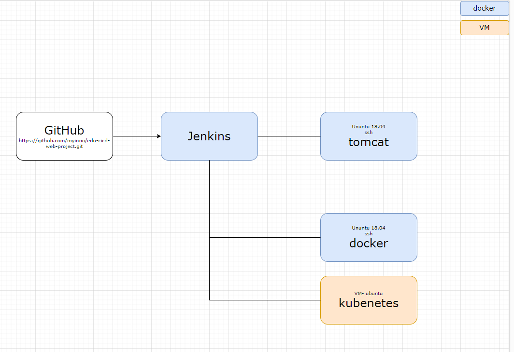
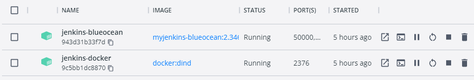
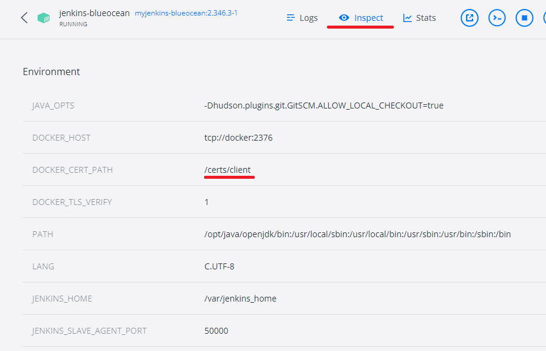
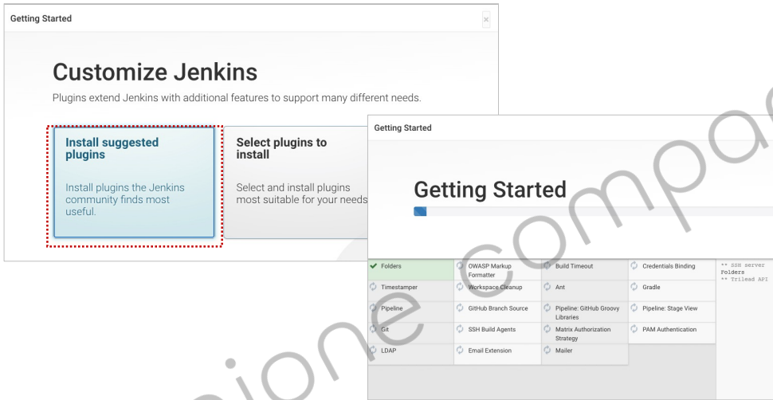

<style>
.burk {
    background-color: red;
    color: yellow;
    display:inline-block;
}
</style>

# 도커 기반 Jenkins
- 도커 기반 Jenkins 설정
- 주요 참조 문서
  - https://www.jenkins.io/doc/tutorials/build-a-java-app-with-maven/
- 설치 환경:노트북, window10
- <span class=burk>회사 네크워크 확경에서 발생하는 "x509" 오류는 "https://auth.docker.io"예외 등록 후 정상 처리됨</span>
  - 이수정(20009791@partner.....) 현장대리인에게 요청함
- 
## 1. Jenkins 서버 생성(개별) 
Docker기반으로 Jenkins 설정
- 원본참조: https://www.jenkins.io/doc/book/installing/docker/
- 이 부분은 실행하지 않아도 됨 (2번에서 docker-compose로 수행함)
- 별도 파일 위치를 표기 하지 않으면 ==> d:\APP\@inflearn\202212-JenkinsCICD\envsystem\docs\

1. Docker에서 브리지 네트워크 만들기
    - Jenkins을 실행하는 도커에서 다른(ex:Maven)등을 Docker기반으로 동작하기 위하여
    - 2개의 Docker 이미지간 통신을 위한 네트워크 설정
    ```bash
    # 생성 스크립트
    docker network create jenkins
    ```
    ```bash
    # (참고)삭제 스크립트
    docker network rm jenkins
    # 리스트
    docker network ls
    ```
2. docker:dind Docker 이미지 실행
   - Pipeline상에서 Maven등을 별도 설치하지 않고 Docker로 실행할떄 이용하는 도커
   - "docker:dind"의 자세한 내용은 아래 참조
   - 아래 명령어는 cmd창에서 실행(^)
   - 10-dind.bat
        ```bash
        docker run --name jenkins-docker --rm --detach ^
          --privileged --network jenkins --network-alias docker ^
          --env DOCKER_TLS_CERTDIR=/certs ^
          --volume jenkins-docker-certs:/certs/client ^
          --volume jenkins-data:/var/jenkins_home ^
          --publish 2376:2376 ^
          docker:dind
        ```
   - <span class=burk>실행후 Docker의 "Environment"  </span>
     - DOCKER_TLS_CERTDIR: /certs  확인 필요
     - git bash 창에서 수행하면 "C:/Program Files/Git/certs"로 설정됨
     - 왜 설정이 안되는지는 확인 안됨

3. Jenkins Docker 생성
   - Dockerfile (Dockerfile-jenkinse)

      ```bash
      FROM jenkins/jenkins:2.375.1
      USER root
      RUN apt-get update && apt-get install -y lsb-release
      RUN curl -fsSLo /usr/share/keyrings/docker-archive-keyring.asc \
      https://download.docker.com/linux/debian/gpg
      RUN echo "deb [arch=$(dpkg --print-architecture) \
      signed-by=/usr/share/keyrings/docker-archive-keyring.asc] \
      https://download.docker.com/linux/debian \
      $(lsb_release -cs) stable" > /etc/apt/sources.list.d/docker.list
      RUN apt-get update && apt-get install -y docker-ce-cli
      USER jenkins
      RUN jenkins-plugin-cli --plugins "blueocean docker-workflow"
      ```
   - 새 도커 이미지를 빌드(Dockerfile이 있는 곳에서 실행)
     - 2023-01-03 회사 Network에서는 오류

         ```shell
         #10 1.992 Unable to retrieve JSON from https://updates.jenkins.io/update-center.json?version=2.346.3: PKIX path building failed: sun.security.provider.certpath.SunCertPathBuilderException: unable to find valid certification path to requested target
         #10 2.419 Error getting update center json
         ```
     ```bash
     docker build -t myjenkins-blueocean:2.346.3-1 .
     ```
4. 컨테이너로 자체 이미지를 실행(CMD창)
    - /home 에 추가 volumn 설정
      -   로컬 PC와 공유 목적
	  - "--env TZ=Asia/Seoul" 추가
    - CMD창에서 수행하지 않으면 'DOCKER_CERT_PATH' 설정이 다른 값으로 됨

      ```bash
      docker run --name jenkins-blueocean --restart=on-failure --detach ^
      --network jenkins --env DOCKER_HOST=tcp://docker:2376 ^
      --env DOCKER_CERT_PATH=/certs/client --env DOCKER_TLS_VERIFY=1 ^
      --volume jenkins-docker-certs:/certs/client:ro ^
      --volume /d/APP/@inflearn/202212-JenkinsCICD/jenkins_SHARE/var:/var/jenkins_home ^
      --volume /d/APP/@inflearn/202212-JenkinsCICD/jenkins_SHARE/home:/home ^
      --publish 2201:22  --publish 8099:8080 --publish 50000:50000 ^
      myjenkins-blueocean:2.375.1-1
      ```

5. 2개의 Docker가 작동여부 확인(설치 완료)
    

    - 도커의 환경설정 정보 확인
    - 

## 2. Jenkins 환경구성(docker-compose)

### 2.3 Jenkins 설정
회사네크워크에서는 수행 안됨

1. jenkins 접속: http://localhost:8099
   - 
2. 주어진 폴더의 Password 입력:    (unlock password)
   - $ cat /var/jenkins_home/secrets/initialAdminPassword
3. Default 모드로 jenkins 설치 (패키지가 설치되어야 함)
   -  
4. 기본 계정 정보 등록
   - 


## 3. 주요 SW 설치

## A.참고

1. Docker Hub 로그인 과정 로그(정상-테더링)
    ```console
    $ docker login -u jcscom13 -p ******** https://index.docker.io/v1/
    WARNING! Using --password via the CLI is insecure. Use --password-stdin.
    WARNING! Your password will be stored unencrypted in /var/jenkins_home/workspace/docker-push@tmp/1ad0eb9a-560b-41a9-9fe5-b8fb939c8b8c/config.json.
    Configure a credential helper to remove this warning. See
    https://docs.docker.com/engine/reference/commandline/login/#credentials-store

    Login Succeeded
    ```
2. 오류 내역(회사 네트워크)
    ```console
    $ docker login -u jcscom13 -p ******** https://index.docker.io/v1/
    WARNING! Using --password via the CLI is insecure. Use --password-stdin.
    Error response from daemon: Get "https://registry-1.docker.io/v2/": Get "https://auth.docker.io/token?account=jcscom13&client_id=docker&offline_token=true&service=registry.docker.io": x509: certificate signed by unknown authority
    [Pipeline] // withDockerRegistry
    ```
## B. 도커 컨테이너 안에서 도커 실행하기
-  https://m.blog.naver.com/PostView.naver?isHttpsRedirect=true&blogId=isc0304&logNo=222274955992
- 도커를 사용해 컨테이너에서 컨테이너를 실행하는 방법
- 

### B.1 Docker In Docker
DinD는 도커 컨테이너 내에서 도커 데몬을 추가로 동작시킵
- 실제 데몬을 동작시켜야 하기 때문에 도커 데몬에 추가 권한이 필요
- DinD 도커를 만들 때 명령을 살펴보면 --privileged를 사용해 추가 권한을 부여하는 명령이 포함
  ```shell
  $ docker run --privileged --name dind1 -d docker:20.10.5-dind
  ```

- hub.docker.com의 도커 컨테이너에서 이 기능을 포함한 이미지를 제공해 누구나 쉽게 구축해서 사용이 가능
- 도커 내의 모양을 확인하면 docker가 동작하는 모습을 확인
  ```shell
  $ docker exec -it dind1 sh
  / # ps
  PID   USER     TIME  COMMAND
  1 root      0:00 dockerd --host=unix:///var/run/docker.sock --host=tcp://0.0.0.0:2376 --tlsverify --tlscacert /certs/server/ca.pem --tlscert /certs/serv
  49 root      0:00 containerd --config /var/run/docker/containerd/containerd.toml --log-level info
  155 root      0:00 sh
  161 root      0:00 ps
  ```

- DinD 방식은 도커 안에 새로운 격리된 환경을 만들 수 있다는 장점이 있지만 **보안상의 문제**로 그리 추천되는 방식은 아닙
  - --privileged 옵션은 
    - Docker는 호스트의 모든 장치에 액세스하는 권한을 부여
    - AppArmor나 SELinux에서 일부 구성을 설정하여 컨테이너가 호스트의 컨테이너 외부에서 실행되는 프로세스와 거의 동일한 호스트 액세스를 허용
    - 간단히 얘기하면 컨테이너가 호스트 전체 권한을 갖는 치명적인 결함을 가집
    - 이 기능을 사용하려면 도커를 컨트롤하는 컨테이너가 호스트에 미칠 영향을 고려해야 합니다.
### B.2 Docker Out of Docker

DooD는 내부에 새로운 컨테이너 서비스를 만들지 않고 기존의 사용하던 컨테이너를 추가로 생성
- docker를 사용해보면 관리자 권한 없이 실행했을 때 /var/run/docker.sock에 대한 권한이 없다는 메시지를 자주 보셨을 겁니다. 
  - 이 파일이 로컬 시스템에서 도커 데몬과 통신할 수 있는 소켓 파일
  - sock 파일을 컨테이너와 공유하면 이 파일을 통해서 도커 명령을 수행
  ```shell
  $ docker run -it -v /var/run/docker.sock:/var/run/docker.sock docker
  ```
- 도커 명령을 실행하면 이 도커 명령은 호스트에서 실행중인 도커 데몬에게 전달됩
- 컨테이너 안에서도 외부 데몬을 사용하는 형태

- DinD 방식에 비해서 DooD 방식은 안전하느냐? 그렇진 않습니다.  
  - 공격을 하는 방향이 바뀔 뿐 막강한 권한을 갖는 것은 동일
  - 단적인 예로 -v 옵션을 사용하면 원격 호스트의 자원을 공유해 공격할 수 있습
  ```shell
  $ docker run -it -v /tmp:/tmp -v /etc/crontab:/etc/crontab --rm busybox sh
  ```
  - tmp와 crontab 파일을 공유하고 tmp 디렉토리에 백도어 파일을 하나 배치하고 crontab을 수정해 실행 예약을 걸어둔다면 호스트의 모든 통제권은 공격자에게 넘어갑니다. 
### B.3 컨테이너 관리를 활용한 서비스

DinD 방식과 DooD 방식은 보안성의 문제가 있음에도 불구하고 컨테이너가 컨테이너를 컨트롤할 수 있는 것은 큰 장점이 있습
- 컨테이너 안에서 개발을 진행하면서도 쿠버네티스처럼 컨테이너가 컨테이너를 관리한다던지, 
- 구름 IDE처럼 컨테이너를 동적으로 생성해 사용자에게 서비스를 제공한다던지
- 클라우드 서비스처럼 사용자 요청에 따라 컨테이너를 동적으로 배치해 서버리스 서비스를 제공하는 등의 다양한 작업이 가능합니다.


- 완전히 별도의 가상환경을 만들 때는 DinD, 
- 가상화된 환경을 다같이 다루고 싶다면 DooD를 선택하시면 됩니다.

