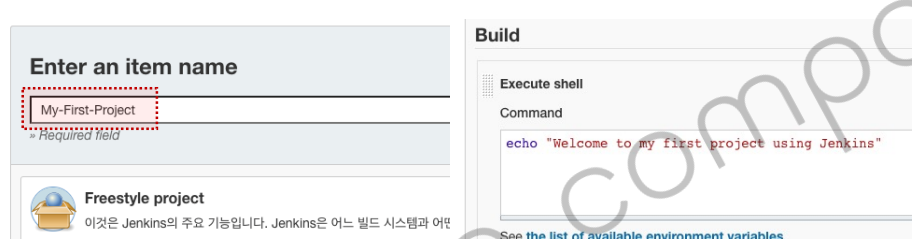

<style>
.burk {
    background-color: red;
    color: yellow;
    display:inline-block;
}
</style>


# My-First_project

## 1. 기본 구성

### JDK 설정
Dashboard > Global Tool Configuration
-  

      ```shell
      name: openjdk11
      JAVA_HOME: /opt/java/openjdk
      ```

## 2. My-First-Project
1. 빌드 설정

     ```shell
     Item name : 01-My-First-Project
     - Freestyle project
     - Build > Execute shell  
       - echo "welcome to my first Project"
     - Save
       Build Now
     ```
   - 
   - 

2. 처리 결과
   -  

3. 프로젝트 정보
    - 2023-01-05(이 시점에는 sshd 미 설치)
    ```shell
    nohup /usr/sbin/sshd -D&
    
    
    root@aaff19fcd953:/var/jenkins_home/jobs/My-First-Project# ls -l
    total 4
    drwxr-xr-x 1 jenkins jenkins 4096 Jan  3 21:41 builds
    -rw-r--r-- 1 jenkins jenkins  688 Jan  3 21:41 config.xml
    -rw-r--r-- 1 jenkins jenkins    2 Jan  3 21:41 nextBuildNumber
    drwxr-xr-x 1 jenkins jenkins 4096 Jan  3 21:40 workspace
    ```  
   - 