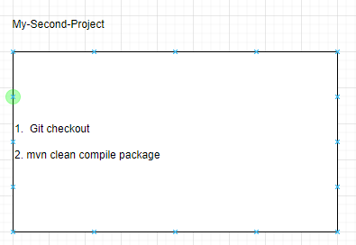
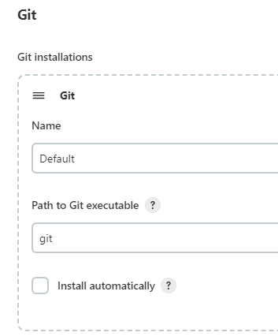
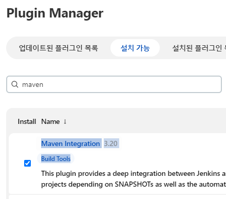
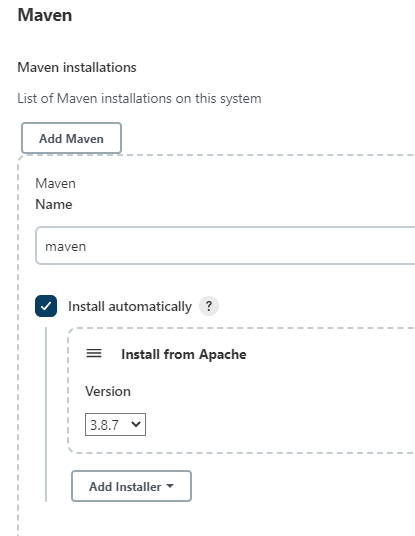
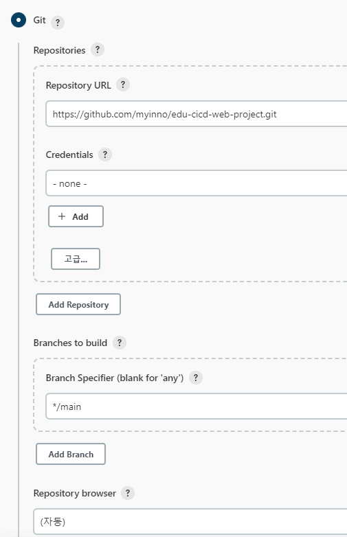
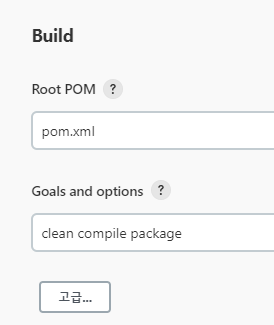

<style>
.burk {
    background-color: red;
    color: yellow;
    display:inline-block;
}
</style>


# Git연동
Git 소스를 다운받안 Maven 빌드 수행
- 

## 1. 기본 구성

### Setup Git plugin

1. GitHub 플러그인 설치 확인                                               
   - Manage Jenkins > Jenkins Plugins > available > github
     - GitHub plugin  버전1.34.5
                                                            
2. Setup Git plugin
   - Manage Jenkins > Global Tool Configuration > git
   - 
   - 별도 설정 없음
3. Setup Maven plugin
   - Manage Jenkins > Jenkins Plugins > available > maven
     - Maven IntegrationVersion,  3.20
     - 
   - Manage Jenkins > Global Tool Configuration > maven
   - 


## 2. My-Second-Project
  ```shell
  Item name : My-Second-Project
  Maven project 
  
  General :- My maven project build
   Source Code Management :
     - Repository URL :https://github.com/myinno/edu-cicd-web-project.git
     - Branch: */main  
  Build
  - Root POM: pom.xml
  - Golds: clean compile package
  ```
- 
- 

### config.xml
```xml
<?xml version='1.1' encoding='UTF-8'?>
<maven2-moduleset plugin="maven-plugin@3.20">
  <actions/>
  <description>My maven project build</description>
  <keepDependencies>false</keepDependencies>
  <properties/>
  <scm class="hudson.plugins.git.GitSCM" plugin="git@4.14.3">
    <configVersion>2</configVersion>
    <userRemoteConfigs>
      <hudson.plugins.git.UserRemoteConfig>
        <url>https://github.com/myinno/edu-cicd-web-project.git</url>
      </hudson.plugins.git.UserRemoteConfig>
    </userRemoteConfigs>
    <branches>
      <hudson.plugins.git.BranchSpec>
        <name>*/main</name>
      </hudson.plugins.git.BranchSpec>
    </branches>
    <doGenerateSubmoduleConfigurations>false</doGenerateSubmoduleConfigurations>
    <submoduleCfg class="empty-list"/>
    <extensions/>
  </scm>
  <canRoam>true</canRoam>
  <disabled>false</disabled>
  <blockBuildWhenDownstreamBuilding>false</blockBuildWhenDownstreamBuilding>
  <blockBuildWhenUpstreamBuilding>false</blockBuildWhenUpstreamBuilding>
  <triggers/>
  <concurrentBuild>false</concurrentBuild>
  <rootModule>
    <groupId>com.njonecompany.web</groupId>
    <artifactId>web</artifactId>
  </rootModule>
  <goals>clean compile package</goals>
  <aggregatorStyleBuild>true</aggregatorStyleBuild>
  <incrementalBuild>false</incrementalBuild>
  <ignoreUpstremChanges>false</ignoreUpstremChanges>
  <ignoreUnsuccessfulUpstreams>false</ignoreUnsuccessfulUpstreams>
  <archivingDisabled>false</archivingDisabled>
  <siteArchivingDisabled>false</siteArchivingDisabled>
  <fingerprintingDisabled>false</fingerprintingDisabled>
  <resolveDependencies>false</resolveDependencies>
  <processPlugins>false</processPlugins>
  <mavenValidationLevel>-1</mavenValidationLevel>
  <runHeadless>false</runHeadless>
  <disableTriggerDownstreamProjects>false</disableTriggerDownstreamProjects>
  <blockTriggerWhenBuilding>true</blockTriggerWhenBuilding>
  <settings class="jenkins.mvn.DefaultSettingsProvider"/>
  <globalSettings class="jenkins.mvn.DefaultGlobalSettingsProvider"/>
  <reporters/>
  <publishers/>
  <buildWrappers/>
  <prebuilders/>
  <postbuilders/>
  <runPostStepsIfResult>
    <name>FAILURE</name>
    <ordinal>2</ordinal>
    <color>RED</color>
    <completeBuild>true</completeBuild>
  </runPostStepsIfResult>
</maven2-moduleset>
```