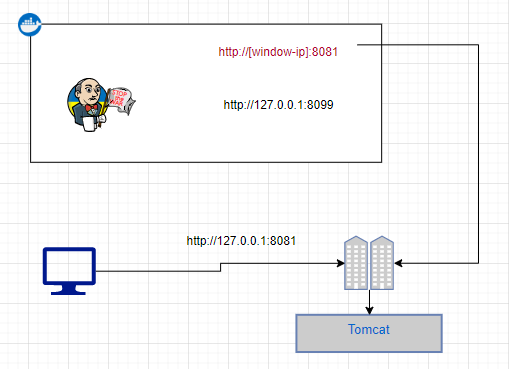
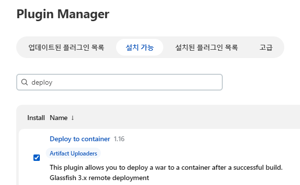
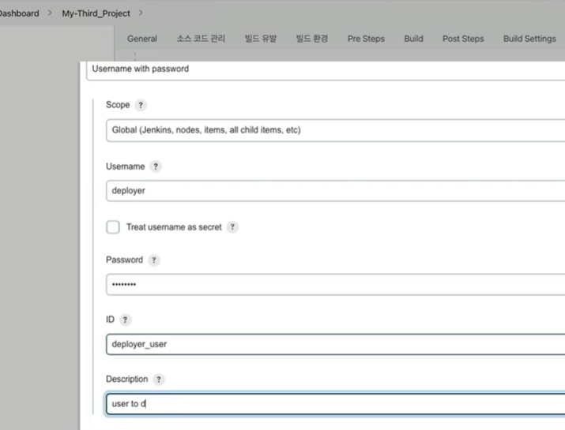
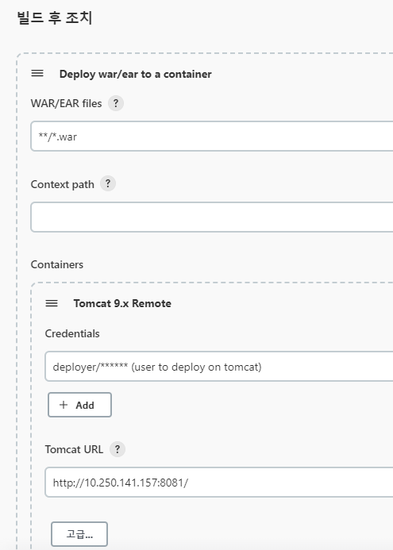
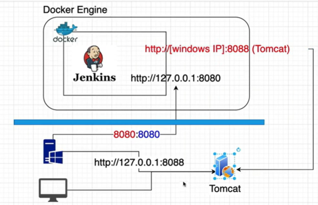
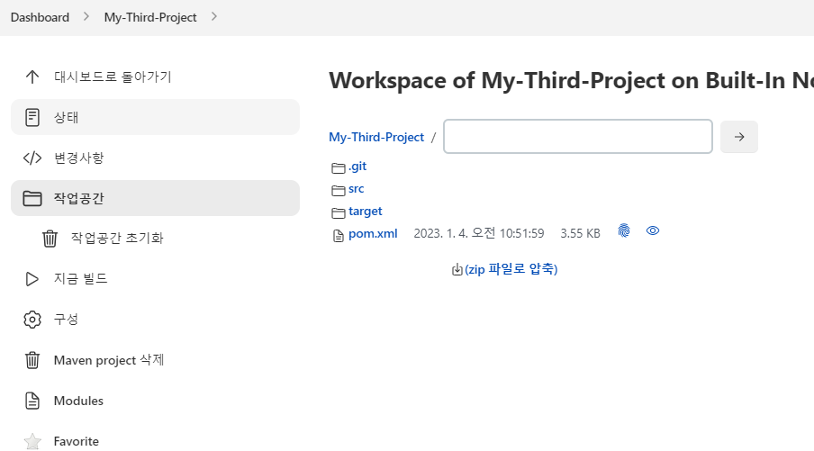
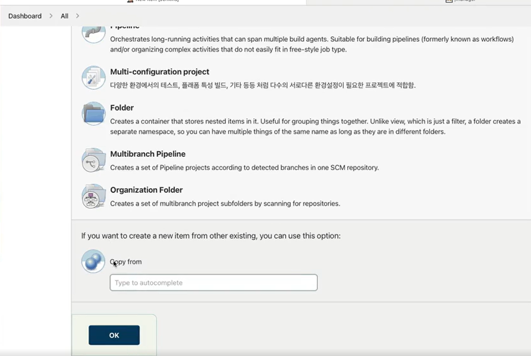

<style>
.burk {
    background-color: red;
    color: yellow;
    display:inline-block;
}
</style>


# A04-Tomcat배포
Tomcat에 배포하기
- Tomcat 서버는 로컬 Pc에 설치되어 있음
- 로컬에 Tomcat이 설치되어 있어야 함
- 

## 1. 기본 구성

### 1.1 Tomcat (Local 설치)
1. Tomcat 설치
    ```shell
    https://tomcat.apache.org
    9.x 버전 사용 
    10 버전은 기존 Application의 변경 필요(이 부분 빠른 확인 필요)   
   
    설치위치(임의): d:\APP\apache-tomcat-9.0.70\
    기동: bin/startup.bat
    ```
2. OpenJDK 설치
    ```shell
    OpenJDK 설치 
    https://jdk.java.net/11/
    ```
3. Tomcat 설정 변경
   -  접근 엑세스 변경  (모두에서 접속하도록 수정: 주석 처리함)   2개의 파일을 동일하게 수정
     - "%TOMCAT_HOME%\webapps\host-manager\META-INF\context.xml"
     - "%TOMCAT_HOME%\webapps\manager\META-INF\context.xml"

      ```shell   
       수정 내용:
       <!--
         <Valve className="org.apache.catalina.valves.RemoteAddrValve"
                allow="127\.\d+\.\d+\.\d+|::1|0:0:0:0:0:0:0:1" />
       -->
       ``` 
   - 포트 변경
      ```shell
       포트 변경 
       %TOMCAT_HOME%\conf\server.xml   ==> 8081
       ```
   - 유저 등록
     -  "%TOMCAT_HOME%\conf\tomcat-users.xml" (마지막 부분)
      ```xml
        <role rolename="manager-gui"/>
        <role rolename="manager-script"/>
        <role rolename="manager-jmx"/>
        <role rolename="manager-status"/>
        <user username="admin" password="admin" roles="manager-gui,manager-script, manager-jmx, manager-status"/>
        <user username="deployer" password="deployer" roles="manager-script"/>
        <user username="tomcat" password="tomcat" roles="manager-gui,manager-script"/>
      ```

4. 관련하여 등록한 환경 변수
    ```shell
    JAVA_HOME=d:\APP\jdk-11.0.15+10
    
    ```
5. 기타
   -  webapps

### 1.2 Jenkins Tomcat 관련 설정
1. Setup Tomcat Plugin
   - Manage Jenkins > Jenkins Plugins > available > "deploy to container" plugin
     - 

## 2. Item 구성

```shell
Item name : My-Third-Project
  - Maven projec


General: 소스코드를 Tomcat서버에 배포 (Remote)
Source Code Management
     - Repository URL :https://github.com/myinno/edu-cicd-web-project.git
     - Branch: */main  

Build
  - Root POM: pom.xml
  - Golds: clean compile package
Post-build Actions
   - Deploy war/ear to a container
   - **/*.war  ==> workspace에서 파일 선택

Post-build Actions
- Container: Tomcat 9.x Remote 
- Tomcat URL: http://10.250.141.157:8081/     ==> IP는 로컬 PC의 IP
```
- 
- 
-  
      
### 2.2 빌드 테스트

- 컨텐츠 수정
  - https://github.com/myinno/edu-cicd-web-project/blob/main/src/main/webapp/WEB-INF/views/index.jsp
- 결과 확인
  - http://10.250.141.157:8081/hello-world/

### 2.3 작업공간(workspace 확인하기)

빌드하면서 생성한 workspace 공간 확인
-  d:\APP\@inflearn\inflearn-JenkinsCICD\jenkins_SHARE\var\jobs\My-Third-Project\workspace\
- 
## A. 기존 프로젝트를 Copy해 오기
