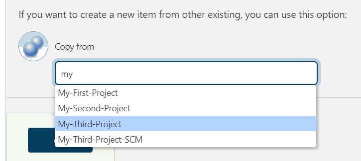
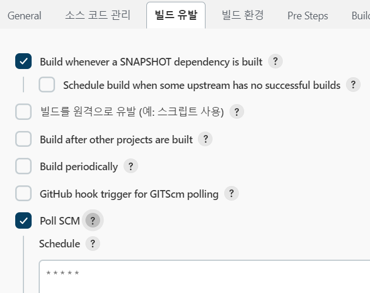

<style>
.burk {
    background-color: red;
    color: yellow;
    display:inline-block;
}
</style>


# A05-PollSCM
주기적인 배포 작업 (변경시, 일정 간격)

Project > Configure > Build Triggers(빌드 유발)
- Build periodically --> cron job (일정 간격)
- Poll SCM --> cron job (소스가 변경시에만)

참고
- Local의 Tomcat은 기동 상태 이어야 함
## 1. 프로젝트 구성
1. Item 생성 - My-Third-Project-SCM
   - copy "My-Third-Project"
   - 
2. 빌드 유발 등록
  ```shell
  Poll SCM
  - * * * * *
  ```
   - 

## 2. 빌드 테스트

Git에 소스를 Commit하면 자동으로 배포됨
- 수정한 소스: https://github.com/myinno/edu-cicd-web-project/blob/main/src/main/webapp/WEB-INF/views/index.jsp
- 배포를 위해서는 Tomcat은 정상 기동 중이어야 함
- 결과 확인: http://127.0.0.1:8081/hello-world/


