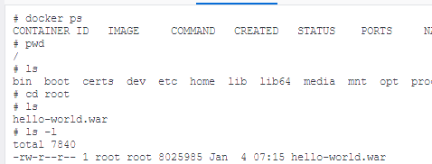

<style>
.burk {
    background-color: red;
    color: yellow;
    display:inline-block;
}
</style>

# RemoteDeploy

Remote서버에 소스 배포

- 빌드한 결과를 다른 서버에 복사하기 위하여 SSH 설치
- 

다루는 내용

1. war 이미지 빌드(이전 과정)
2. Remote 서버에 복사(ssh)
3. Docker 이미지 생성 및 컨테이너화

## 1. 환경 설정

### Setup Publish Over Plugin

1. Remote에 복사하기 위하여  SSH plugin 설치

   - Dashboard > Plugin Manager  > 설치 가능:  **Publish Over SSH**
   - 회사 네트워크 오류(테더링 했음)
2. 시스템 설정

   - Dashboard  >  Configure System
   - 

     ```shell
     Manage Jenkins > Configure System > SSH Server
     - Add SSH Servers
     - Name: ssh-docker   (이서버는 A01-???에서 생성함)
     - Hostname: [Remote IP] ex)10.250.141.157 (내 PC IP)
       - localhost를 입력하면 jenkins 서버를 지칭함
       - 'ssh-docker' 이름 입력
     - Username: root
     - Passphrase/Password: root
     - Port: 22  # docker에서 직접 접속
     - Test Configuration
     ```
3. (참고) Remote Docker

   ```shell
   $ systemctl start docker
   $ systemctl status docker
   ```

## 2. New Item (My-Docker-Project)

### 2.1 SSH로 다른 서버에 war 파일 배포하기
1. Item 생성

   ```shell
   Item name : My-Docker-Project
   - Copy from: My-Third-Project-SSM
   ```
2. 기존 정보 수정

   - 주기적 반영 제거

     ```shell
     Build Triggers
     - Poll SCM -> Disabl
     ```
3. Post-build Actions (빌드 후 조치)

   - Local 배포 제거
     ```shell
     Deploy war/ear to a container --> Delete
     ```
   - SSH을 이용하여 전달
     ```shell
     "Send build artifacts over SSH"
     - SSH Server
       -name: ssh-docker
       - Transfer Set
         - Source files: target/*.war
         - Remove prefox: target     #  *.war만 복사
         - Remote Directory: .       # /root
     ```
4. build

   - 목적서버에 파일이 복사여부 확인
   - 

### 2.2 Docker 이미지 생성해 보기
여기서는 수기로 진행하는 방법 확인 
- 이후 해당 과정을 다시 jenkins에 등록함


1. Remote 서버에 Dockerfile 생성(Docker이미지에 추가했음)

   ```shell
   FROM tomcat:9.0
   LABEL myinno.authors="msa.myinno@gmail.com"
   COPY ./hello-world.war /usr/local/tomcat/webapps
   ```
2. docker build (docker 서버에서)

   - 아래 실행은 docker에 직접 접속한 터미널에서 수행해야함(ssh로 접속은 오류)

   ```shell
   $ docker build -t docker-server -f Dockerfile-tomcat .   

   $ docker images
   REPOSITORY      TAG       IMAGE ID       CREATED              SIZE
   docker-server   latest    ec652dc1c2a8   About a minute ago   484MB
   tomcat          9.0       24849d4d07c1   3 weeks ago          476MB

   $ docker run -p 8080:8080 --name mytomcat docker-server:latest
   $ docker run -d --rm -p 8083:8080 --name mytomcat docker-server:latest

   # docker ps -a
   CONTAINER ID   IMAGE                  COMMAND             CREATED         STATUS    PORTS     NAMES
   a96aa862d983   docker-server:latest   "catalina.sh run"   3 minutes ago   Created             mytomcat   

   ```

   - 
     - 8083 --> 8080 --> 8080 (그림과 일부 다름)
   - 로컬에서 접속 테스트
     - http://127.0.0.1:8083/hello-world/
     - ssh-docker 에서 "curl localhost:8080" ==> 오륲 발생
     - (2023-01-07)  docker를 다른 방식으로 정상 테스트 되었으나 일단 현 상태로 테스트 진행함

        ```shell
        5. dind 테스트
        1> From my host machine I run the container with docker installed:
        docker run --privileged -t -i --rm -e LOG=file -p 18080:8080 jpetazzo/dind
        
        2> Then inside the container I've pulled nginx image and run it with
        
        docker run -d -p 8080:80 nginx
        
        3> 테스트 
         로컬에서 : curl localhost:18080 --> 정상 작동 확인함
        ```

### 2.3 Docker 이미지 생성해 보기    

docker 이미지 직접 생성해 보기

1. docker 생성을 jenkins에서 수행

    ```shell
    docker build -t docker-server -f Dockerfile-tomcat; 
    docker run -d --rm -p 8080:8080 --name mytomcat docker-server:latest;
    ```
   - 

2. 현제 시점의 문제점 (2023-01-08)
   - docker-compose 버전으로 생성한 경우는 
     - jenkins 도커에서 ssh로 'ssh-docker'로 접속하면 "docker ps"명령 실행 안됨
     - 손으로 'ssh-docker'에서 docker를 생성하면, 직접 해당 도커에 접속하면 정상 동적 학인되나, 포트 forward가 되지 않음


