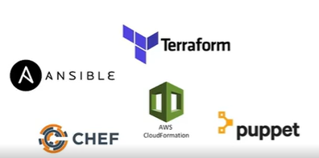
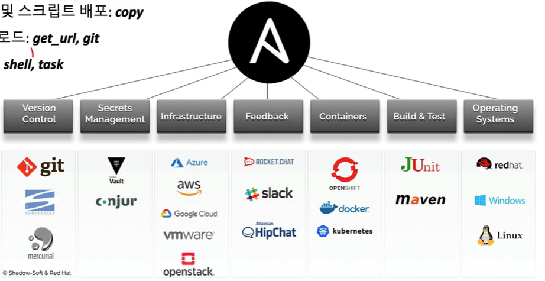
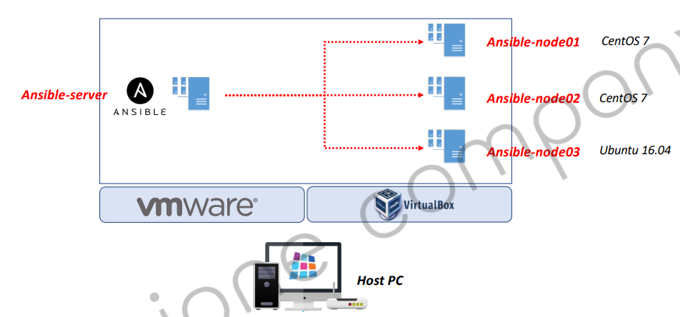
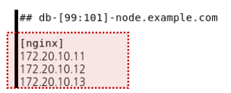
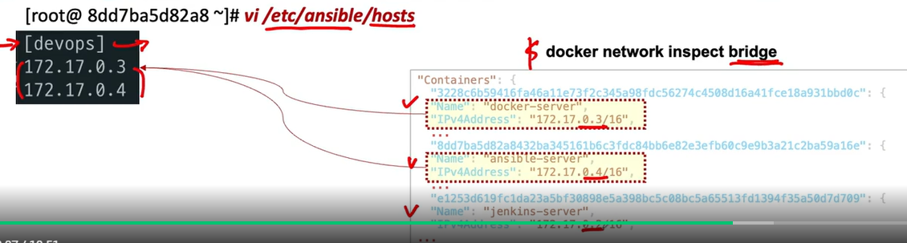
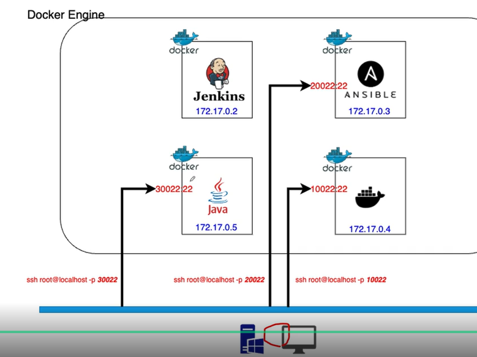
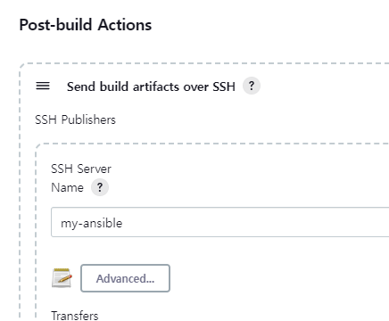
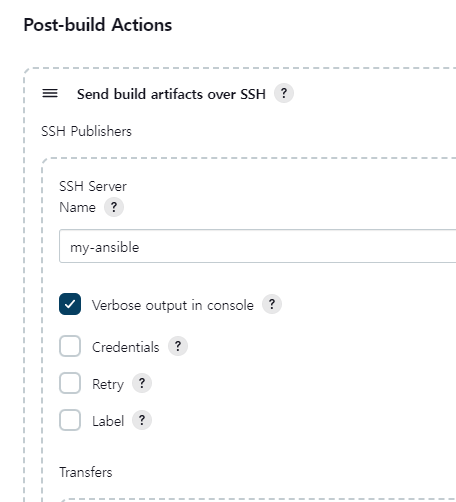
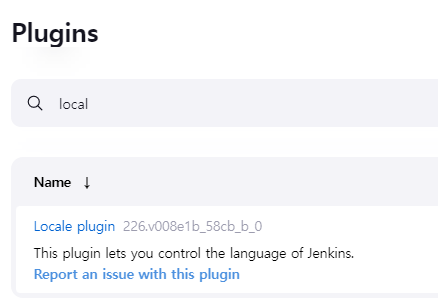
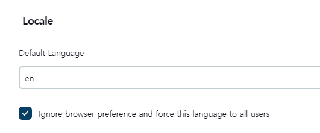

<style>
.burk {
    background-color: red;
    color: yellow;
    display:inline-block;
}
</style>

# Infrastructure as Code

이론
- Infrastructure as Code 개요와 Ansible의 이행
- Docker 컨테이너로 Ansible 실행하기
- Ansible 설정과 작동 과정
- Ansible 명령어
- Ansible 모듈 사용
- Ansible Playbook 사용하기
- Jenkins + Ansible 연동하기
- Ansible을 이용한 Docker 이미지 관리

실습
- 실습5) Jenkins + Ansible Playbook 사용하기 ①
- 실습5) Jenkins + Ansible Playbook 사용하기 ②
- 실습6) Ansible Playbook으로 Docker 컨테이너 생성하기

2023-01-08
## 1. Infrastructure as Code 개요와 Ansible의 이행

### 주요 Open 소스 동향

[Best of 2021 – 11 Open Source DevOps Tools We Love For 2021]()
1. Kubernetes
2. Docker
3. Istio
4. GitHub Actions
5. Jenkins
6. Prometheus
7. <span class=burk>Ansible</span>
   - Ansible, Chef, Terraform : IaC 
8. Chef : Chef is another infrastructure-as-code (IaC)
9. Terraform
10. JAMStack
11. ELK Stack

2016 순위 - https://devops.com/9-open-source-devops-tools-love/
1. Nagios (& Icinga): Infrastructure monitoring
2. Monit
3. ELK – Elasticsearch, Logstash, Kibana – via Logz.io
4. onsul.io
5. jenkins
6. Docker
7. <span class=burk>Ansible</span>
8. Collectd/Collectl
9. Git (GitHub)


[Top 10 Open-Source DevOps Tools Rundown(2022-11)](https://dev.to/danielhu/top-10-open-source-devops-tools-that-you-should-know-ndg)
1. GitLab CE
2. Jenkins
3. Argo CD
4. Tekton:  flexible Kubernetes-native open-source framework for creating CI/CD systems
5. <span class=burk>Ansible</span>:  simple IT automation system
6. Helm: streamlines installing and managing Kubernetes applications
7. Harbor: cloud native registry project that stores, signs, and scans content.
8. Sonarqube: 
9. Prometheus
10. DevStream

### Infrastructure as Code
[IaC란](https://learn.microsoft.com/ko-kr/devops/deliver/what-is-infrastructure-as-code) 
- 시스템, 하드웨어 또는 인터페이스의 구성정보를 파일(스크립트)을 통해 관리 및 프로비저닝
- IT 인프라스트럭처, 베어 메탈 서버 등의 물리 장비 및 가상 머신과 관련된 구성 리소스를 관리
- 버전 관리를 통한 리소스 관리(스크립터 관리)
  - 
  - Terraform: DSL
### Configuration Management Tools

| |Puppet |Chef |Salt | Ansible|
| :----| :---- | :---- | :---- | :----|
|개발사| Puppet Labs| Opscode| SaltStack| Redhat|
|등장 |2005.08| 2009.01| 2011.03| 2012.03|
|개발언어| Ruby| Ruby, Erlang |Python| **Python**|
|주요고객| Google, ebay, Disney … |Facebook, Ancestry.com … |Linkedin, HP … |Evernotes, Raskspace …|
|Base| Puppet Forge| Chef Supermarket| Slag-Formula| Ansible Galaxy|
|Web UI| Puppet Enterprise| Chef Manage| SaltStack Enterprise| Ansible Tower|
|Definition File| 자체 DSL,내장 Ruby|자체 DSL (Ruby 베이스)| YAML,<BR>자체 DSL (Python 베이스)|YAML  |
|Agent| 필요| 필요| 필요 or 불필요 |**불필요**|
|사용률| ★★★| ★★★| ★| ★★★|
|사용성| ★| ★| ★| ★★★|

### Ansible

Ansible의 특징
- 여러 개의 서버를 효율적으로 관리할 수 있게 해주는 환경 구성 자동화 도구
  - Configuration Management, Deployment & Orchestration tool
  - IT infrastructure 자동화
- Push 기반 서비스
- Simple, Agentless

할 수 있는 일
- 설치: apt-get, yum, homebrew
- 파일 및 스크립트 배포: copy
- 다운로드: get_url, git
- 실행: shell, task
- 

결과
- 직관적으로 전달됨
- ok / failed / changed / unreachable                   

구성도
- Window에 설치는 어렵다
- 


#### Install Ansible
Ansible Server 설치 (Linux)
  ```shell
  $ yum install ansible
  $ ansible --version
  ```
환경 설정 파일 > /etc/ansible/ansible.cfg 
- Ansible에서 접속하는 호스트 목록 ==>  /etc/ansible/hosts
  - 
  - nginx라는 그룹을 만들고, 3개의 서버를 등록

## 2. Docker 컨테이너로 Ansible 실행하기
14Page

강의
```shell
Docekr repository
https://hub.docker.com/r/edowon0623
Ansible 이미지 다운로드
Windows, MacOS intel chip) docker pull edowon0623/ansible:latest (updated by 2022-09-21)
MacOS silicon chip, m1) docker pull edowon0623/ansible-server:m1
Windows) Ansible 컨테이너 실행 명령어 (방법1)
docker run --privileged -itd --name ansible-server -p 20022:22 -p 8081:8080 -e container=docker -v /sys/fs/cgroup:/sys/fs/cgroup edowon0623/ansible:latest /usr/sbin/init
컨테이너에서 실행, /etc/sysconfig/docker 파일이 존재하지 않을 경우에는 아래의 vi, sed 명령어는 실행하지 않음)
$ vi /etc/sysconfig/docker
$ sed -i -e 's/overlay2/vfs/g' /etc/sysconfig/docker-storage
$ systemctl start docker
$ systemctl status docker
Windows) Ansible 컨테이너 실행 명령어 (방법2, 위 명령어로 실행되지 않을 경우)
docker run -itd --name ansible-server -p 20022:22 -e container=docker --tmpfs /run --tmpfs /tmp -v /sys/fs/cgroup:/sys/fs/cgroup:ro -v /var/run/docker.sock:/var/run/docker.sock edowon0623/ansible:latest /usr/sbin/init
컨테이너에서 실행
$ systemctl status docker
MacOS intel chip) Ansible 컨테이너 실행 명령어
docker run --privileged --itd -p 20022:22 -p 8081:8080 -e container=docker -v /sys/fs/cgroup:/sys/fs/cgroup edowon0623/ansible:latest /usr/sbin/init
컨테이너에서 실행, /etc/sysconfig/docker 파일이 존재하지 않을 경우에는 아래의 vi, sed 명령어는 실행하지 않음)
$ vi /etc/sysconfig/docker
$ sed -i -e 's/overlay2/vfs/g' /etc/sysconfig/docker-storage
$ systemctl start docker
$ systemctl status docker
MacOS silicon chip, m1)) Ansible 컨테이너 실행 명령어
docker run --privileged --itd -p 20022:22 -p 8081:8080 -e container=docker -v /sys/fs/cgroup:/sys/fs/cgroup edowon0623/ansible-server:m1 /usr/sbin/init
컨테이너에서 실행)
$ systemctl start docker
$ systemctl status docker
SSH 접속 키 생성
ssh-keygen
ssh-copy-id root@[접속할 서버 IP]
```
### Create a docker instance for Ansible
1. down
   - https://hub.docker.com/r/edowon0623
     - Windows, MacOS) $ docker pull edowon0623/ansible
     - Apple silicon, m1 chip) $ docker pull edowon0623/ansible-server:m1
  - dockerfile(https://github.com/joneconsulting/docker-files.git)
  - d:\APP\@inflearn\202212-JenkinsCICD\envsystem\ansible\Dockerfile_ansible
    ```shell
    # FROM centos:7
    FROM centos:8
    
    RUN yum -y update; yum clean all
    RUN yum -y install systemd; yum clean all; 
    
    
    VOLUME ["/sys/fs/cgroup"]
    
    RUN sed -i 's/mirrorlist/#mirrorlist/g' /etc/yum.repos.d/CentOS-Linux-*
    RUN sed -i 's|#baseurl=http://mirror.centos.org|baseurl=http://vault.centos.org|g' /etc/yum.repos.d/CentOS-Linux-*
    
    # install sshd
    RUN yum install -y epel-release
    RUN yum install -y openssh-server \
    && sed 's/#PermitRootLogin yes/PermitRootLogin yes/' -i /etc/ssh/sshd_config \
    && echo 'root:root' | chpasswd \
    && ssh-keygen -f /etc/ssh/ssh_host_rsa_key -N '' -t rsa
    RUN yum install -y openssh-clients
    
    RUN yum update -y
    RUN yum install -y iptables
    # RUN yum install -y docker docker-registry
    # RUN yum install -y docker
    # RUN yum install -y docker-ce-cli 
    # RUN yum install -y containerd.io
    # RUN sed -i -e 's/overlay2/vfs/g' /etc/sysconfig/docker-storage
    
    RUN yum install -y yum-utils
    RUN yum-config-manager --add-repo https://download.docker.com/linux/centos/docker-ce.repo
    RUN yum install -y --allowerasing docker-ce docker-ce-cli containerd.io
    
    # RUN yum install -y --skip-broke ansible
    RUN yum install -y python38
    RUN pip3 install --upgrade --ignore-installed pip setuptools
    RUN pip3 install ansible
    
    WORKDIR /root
    COPY ./Dockerfile_ansible ./Dockerfile_ansible
    
    EXPOSE 22
    
    ENTRYPOINT ["/sbin/init", "systemctl", "start", "sshd"]
    # CMD ["systemctl", "start", "sshd"]
    ```

2. Run Ansible Server (Windows, MacOS) - 교안 기준
    ```shell
    $ docker run --privileged \
      --name ansible-server -itd \
      -p 20022:22 -p 8081:8080 \
      -e container=docker \
      -v /sys/fs/cgroup:/sys/fs/cgroup \
      edowon0623/ansible:latest /usr/sbin/init 
   
    $ docker run --privileged --name ansible-server -itd \
      -p 20022:22 -p 8081:8080 \
      -e container=docker \
      -v /sys/fs/cgroup:/sys/fs/cgroup \
      --cgroupns=host \
      edowon0623/ansible:latest /usr/sbin/init
    ```        
### Create a docker instance for Ansible(변경 적용
기준: d:\APP\@inflearn\202212-JenkinsCICD\envsystem\ansible\
- 미 해결 문제
  - docker 가 자동 실행되지 않는다  (생성후 아래 실행하여야 함)
  - systemctl && systemctl start docker
    - 단 ssh로 접속해도 'docker ps'가 실행된다


1. DockerFile : Dockerfile_ansible
   - Dockerfile_ansible
    ```shell
    FROM centos:8
    
    RUN yum -y update; yum clean all
    RUN yum -y install systemd; yum clean all; 
    
    
    VOLUME ["/sys/fs/cgroup"]
    
    RUN sed -i 's/mirrorlist/#mirrorlist/g' /etc/yum.repos.d/CentOS-Linux-*
    RUN sed -i 's|#baseurl=http://mirror.centos.org|baseurl=http://vault.centos.org|g' /etc/yum.repos.d/CentOS-Linux-*
    
    # install sshd
    RUN yum install -y epel-release
    RUN yum install -y openssh-server \
      && sed 's/#PermitRootLogin yes/PermitRootLogin yes/' -i /etc/ssh/sshd_config \
      && echo 'root:root' | chpasswd \
      && ssh-keygen -f /etc/ssh/ssh_host_rsa_key -N '' -t rsa
    RUN yum install -y openssh-clients
    
    RUN yum update -y
    RUN yum install -y iptables
    
    RUN yum install -y yum-utils
    RUN yum-config-manager --add-repo https://download.docker.com/linux/centos/docker-ce.repo
    RUN yum install -y --allowerasing docker-ce docker-ce-cli containerd.io
    
    RUN yum install -y python38
    RUN pip3 install --upgrade --ignore-installed pip setuptools
    RUN pip3 install ansible
    
    WORKDIR /root
    COPY ./Dockerfile_ansible ./Dockerfile_ansible
    
    EXPOSE 22
    
    ENTRYPOINT ["/usr/sbin/init", "systemctl", "start", "sshd"]
    CMD [""]
    
    ```
2. 기동 shell
   - 10-ansible-build.bat  [cmd 창에서 실행하여야 함]
    ```shell
    $ docker build -t my-ansible:1.0 -f Dockerfile_ansible .
    
    $ docker run --privileged --name my-ansible -it --rm ^
          -p 20022:22 -p 8081:8080 ^
          -e container=docker ^
          -v /sys/fs/cgroup:/sys/fs/cgroup ^
          --cgroupns=host ^
          my-ansible:1.0 /usr/sbin/init	  
    
    $ docker exec -it my-ansible bash    (아래를 Dockerfile_ansible에 추가 실폐)
    # systemctl
    # systemctl start docker
    ```
3. ansible 설치 확인
   - 교안 버전은 2.13.2
    ```shell
    sh-4.4# ansible --version
    ansible [core 2.13.7]
      config file = None
      configured module search path = ['/root/.ansible/plugins/modules', '/usr/share/ansible/plugins/modules']
      ansible python module location = /usr/local/lib/python3.8/site-packages/ansible
      ansible collection location = /root/.ansible/collections:/usr/share/ansible/collections
      executable location = /usr/local/bin/ansible
      python version = 3.8.8 (default, Aug 25 2021, 16:13:02) [GCC 8.5.0 20210514 (Red Hat 8.5.0-3)]
      jinja version = 3.1.2
      libyaml = True
    ```
4. aisible 이 관리하는 클라이언트 등록
   - /etc/ansible/hosts  (디렉토리 부터 생성함)
    ```shell
    [root@6942cbe58f34 ansible]# cat hosts
    [devops]
    172.18.0.6      -- ansible
    172.18.0.4      --ssh-docker
    ```
    - "$ docker network inspect envsystem_default"로 확인
    - 하나의 docker-compose로 실행함 (같은 network을 사용하라고..)
    - 
5. ansible 서버에서 자동으로 ssh 접속하기(비밀번호 없이)
   - ssh-keygen
    ```shell
    # 비밀번호 없이 Key 생성
    sh-4.4# ssh-keygen
    Generating public/private rsa key pair.
    Enter file in which to save the key (/root/.ssh/id_rsa): 
    Enter passphrase (empty for no passphrase): 
    Enter same passphrase again: 
    Your identification has been saved in /root/.ssh/id_rsa.
    Your public key has been saved in /root/.ssh/id_rsa.pub.
    The key fingerprint is:
    SHA256:0zbpQNwG2YHNud6iwJcpMVuhIXmxBsL9DWVrbOygDLA root@4e7c109cdc6d
    The key's randomart image is:
    +---[RSA 3072]----+
    |.......o+*.o     |
    | o..+.+*++=      |
    |E .  ++=O.o.     |
    |   o o=*oo..     |
    |    o. =S+=.     |
    |      = +=o..    |
    |       + ...     |
    |        .        |
    |                 |
    +----[SHA256]-----+
    ```
   - public key 복사
    ```shell
    [root@4e7c109cdc6d ansible]# ssh-copy-id root@172.18.0.6
    /usr/bin/ssh-copy-id: INFO: Source of key(s) to be installed: "/root/.ssh/id_rsa.pub"
    The authenticity of host '172.18.0.6 (172.18.0.6)' can't be established.
    ECDSA key fingerprint is SHA256:r1g5ft+pSPCyOFnuk236DdyKossfq1XJNdTgJkZT4m0.
    Are you sure you want to continue connecting (yes/no/[fingerprint])? yes
    /usr/bin/ssh-copy-id: INFO: attempting to log in with the new key(s), to filter out any that are already installed
    /usr/bin/ssh-copy-id: INFO: 1 key(s) remain to be installed -- if you are prompted now it is to install the new keys
    root@172.18.0.6's password:
    
    Number of key(s) added: 1
    
    Now try logging into the machine, with:   "ssh 'root@172.18.0.6'"
    and check to make sure that only the key(s) you wanted were added.
    ``` 

## 3. Ansible 설정과 작동 과정
2023-01-09
-  이전 작업과 유사 : Docker 컨네이너로 Ansible 실행하기

1. 'clear' 명령어 설치
    ```shell
    # yum install -y ncurses
    # clear
    ```
2. ip 확인
    ```shell
    [root@4e7c109cdc6d ~]# hostname -i
    172.18.0.6
    ```
3. 서버 구성
   -  

## 4. Ansible 명령어
1. ssh 자동으로 로그인 하기
    ```shell
    $ ssh-keygen
    $ ssh-copy-id root@172.18.0.4
    ```
2. Test Ansible module: 실행 옵션
   - -i (--inventory-file) : 적용 될 호스트들에 대한 파일 정보 (/etc/ansible/hosts)
   - -m (--module-name) : 모듈 선택
   - -k (--ask-pass) : 관리자 암호 요청
   - -K (--ask-become-pass) : 관리자 권한 상승
   - --list-hosts : 적용되는 호스트 목록
   - **멱등성**
     - 같은 설정을 여러 번 적용하더라도 결과가 달라지지 않는 성질
     - ex) echo -e “[mygroup]\n172.20.10.11” >> /etc/ansible/hosts
       - 한번만 적용된다
## 5. Ansible 모듈 사용
1. 지원하는 모듈
    ```shell
    https://docs.ansible.com/ansible/2.9/modules/list_of_all_modules.html
    ```
2. 기본 명령어 사용방법
   - ansible all -m ping
     - all: 모든 Group
     - -m: 모듈 선택
     - ping
    ```shell
    [root@4e7c109cdc6d ansible]# ansible all -m ping
    172.18.0.6 | SUCCESS => {
    "ansible_facts": {
    "discovered_interpreter_python": "/usr/libexec/platform-python"
    },
    "changed": false,
    "ping": "pong"
    }
    172.18.0.4 | SUCCESS => {
    "ansible_facts": {
    "discovered_interpreter_python": "/usr/bin/python3"
    },
    "changed": false,
    "ping": "pong"
    }   
   
    # ansible devops -m ping
    ```
   - 특정 서버  stop 이후
    ```shell
    [root@4e7c109cdc6d ansible]# ansible devops -m ping
    172.18.0.6 | SUCCESS => {
        "ansible_facts": {
            "discovered_interpreter_python": "/usr/libexec/platform-python"
        },
        "changed": false,
        "ping": "pong"
    }
    172.18.0.4 | UNREACHABLE! => {
        "changed": false,
        "msg": "Failed to connect to the host via ssh: ssh: connect to host 172.18.0.4 port 22: Connection timed out",
        "unreachable": true
    }
    ```
3. Exam1) 디스크 용량 확인
    ```shell
    [root@4e7c109cdc6d ansible]# ansible all -m shell -a "free -h"
    172.18.0.4 | CHANGED | rc=0 >>
                  total        used        free      shared  buff/cache   available
    Mem:            11G        1.6G        6.1G         13M        4.0G        9.8G
    Swap:            0B          0B          0B
    172.18.0.6 | CHANGED | rc=0 >>
                  total        used        free      shared  buff/cache   available
    Mem:           11Gi       1.6Gi       6.1Gi        13Mi       4.0Gi       9.8Gi
    Swap:            0B          0B          0B
    ```
4. Exam2) 파일 전송
    ```shell
    # ansible all -m copy -a "src=./test.txt dest=/tmp"
    172.18.0.4 | CHANGED => {
        "ansible_facts": {
            "discovered_interpreter_python": "/usr/bin/python3"
        },
        "changed": true,
        "checksum": "f1bd7bc107ea22b226f211cf94991ad83ec10a0a",
        "dest": "/tmp/test.txt",
        "gid": 0,
        "group": "root",
        "md5sum": "dedc1f20145899a3f253a03ffc752d6b",
        "mode": "0644",
        "owner": "root",
        "size": 9,
        "src": "/root/.ansible/tmp/ansible-tmp-1673249316.648154-38919-26946297876453/source",
        "state": "file",
        "uid": 0
    }
    ...
    ```
5. Exam3) 서비스 설치
   - Apache 웹서버 설치 : "yum install httpd"
   - ubuntu서버에서는 오류 발생함
   - "state=present": 다운로드 받아라
    ```shell
    [root@4e7c109cdc6d ansible]# ansible all -m yum -a "name=httpd state=present"
    172.18.0.4 | FAILED! => {
        "ansible_facts": {
            "pkg_mgr": "apt"
        },
        "changed": false,
        "msg": [
            "Could not detect which major revision of yum is in use, which is required to determine module backend.",
            "You should manually specify use_backend to tell the module whether to use the yum (yum3) or dnf (yum4) backend})"
        ]
    }
    172.18.0.6 | CHANGED => {
        "ansible_facts": {
            "discovered_interpreter_python": "/usr/libexec/platform-python"
        },
        "changed": true,
        "msg": "",
        "rc": 0,
        "results": [
            "Installed: apr-1.6.3-12.el8.x86_64",
            "Installed: httpd-filesystem-2.4.37-43.module_el8.5.0+1022+b541f3b1.noarch",
            "Installed: apr-util-1.6.1-6.el8.x86_64",
            "Installed: apr-util-bdb-1.6.1-6.el8.x86_64",
            "Installed: httpd-tools-2.4.37-43.module_el8.5.0+1022+b541f3b1.x86_64",
            "Installed: mod_http2-1.15.7-3.module_el8.4.0+778+c970deab.x86_64",
            "Installed: brotli-1.0.6-3.el8.x86_64",
            "Installed: apr-util-openssl-1.6.1-6.el8.x86_64",
            "Installed: mailcap-2.1.48-3.el8.noarch",
            "Installed: centos-logos-httpd-85.8-2.el8.noarch",
            "Installed: httpd-2.4.37-43.module_el8.5.0+1022+b541f3b1.x86_64"
        ]
    }
    ```
## 6. Ansible Playbook 사용하기
사용자가 원하는 내용을 미리 작성해 놓은 파일
- ex) 설치, 파일 전송, 서비스 재시작 …
- ex) 다수의 서버에 반복 작업을 처리하는 경우


Playbook
- 구성요소
  - hosts: 적용할 그룹
  - tasks: task
- $ vi first-playbook.yml 작성
- $ ansible-playbook first-playbook.yml
- $ cat /etc/ansible/hosts

1. 처음 예제 실행하기
   - 스크립터
    ```shell
    # cat first_playbook.yaml
    ---
    - name: Ansible_vim
      hosts: localhost
      tasks:
        - name: Add ansible hosts
          blockinfile:
            path: /etc/ansible/hosts
            block: |
              [mygroup]
              172.20.10.11
    ```   
    - 실행
    ```shell
    # ansible-playbook first_playbook.yaml
    
    PLAY [Ansible_vim] ***********************************************************************************************************************************************************************
    
    TASK [Gathering Facts] *******************************************************************************************************************************************************************
    ok: [localhost]
    
    TASK [Add ansible hosts] *****************************************************************************************************************************************************************
    changed: [localhost]
    
    PLAY RECAP *******************************************************************************************************************************************************************************
    localhost                  : ok=2    changed=1    unreachable=0    failed=0    skipped=0    rescued=0    ignored=0
    
    ```
    - 결과 확인   
    ```shell
    # cat /etc/ansible/hosts
    [devops]
    172.18.0.6
    172.18.0.4
    # BEGIN ANSIBLE MANAGED BLOCK
    [mygroup]
    172.20.10.11
    # END ANSIBLE MANAGED BLOCK
    ```

2. Ansible Playbook 예제 – 파일 복사
   - localhost에서 devops 서버로 복사 
   - 스크립터: playbook-sample1.yml
    ```shell
    - name: Ansible Copy Example Local to Remtoe 
      hosts: devops
      tasks:
        - name: copying file with playbook
          copy:
            src: ./sample.txt
            dest: /tmp
            owner: root
            mode: 0644
    ```
    - 실행
    ```shell
    # ansible-playbook playbook-sample1.yml
    
    PLAY [Ansible Copy Example Local to Remtoe] **********************************************************************************************************************************************
    
    TASK [Gathering Facts] *******************************************************************************************************************************************************************
    ok: [172.18.0.4]
    ok: [172.18.0.6]
    
    TASK [copying file with playbook] ********************************************************************************************************************************************************
    changed: [172.18.0.4]
    changed: [172.18.0.6]
    
    PLAY RECAP *******************************************************************************************************************************************************************************
    172.18.0.4                 : ok=2    changed=1    unreachable=0    failed=0    skipped=0    rescued=0    ignored=0
    172.18.0.6                 : ok=2    changed=1    unreachable=0    failed=0    skipped=0    rescued=0    ignored=0
    ```
    - 한쪽에서만 파일을 지우고 다시 실행
    ```shell
    
    172.18.0.4                 : ok=2    changed=1    unreachable=0    failed=0    skipped=0    rescued=0    ignored=0
    172.18.0.6                 : ok=2    changed=0    unreachable=0    failed=0    skipped=0    rescued=0    ignored=0
    ```

3. Ansible Playbook 예제 – 다운로드
    ```shell
    # cat playbook-sample2.yml
    ---
    - name: Download Tomcat9 from tomcat.apache.org
      hosts: devops
      tasks:
       - name: Create a Directory /opt/tomcat9
         file:
           path: /opt/tomcat9
           state: directory
           mode: 0755
       - name: Download Tomcat using get_url
         get_url:
           url: https://dlcdn.apache.org/tomcat/tomcat-9/v9.0.70/bin/apache-tomcat-9.0.70.tar.gz
           dest: /opt/tomcat9
           mode: 0755
           checksum: sha512:https://archive.apache.org/dist/tomcat/tomcat-9/v9.0.70/bin/apache-tomcat-9.0.70.tar.gz.sha512
    ```
    - ansible-playbook playbook-sample2.yml
    ```shell
    # ansible-playbook playbook-sample2.yml
    
    PLAY [Download Tomcat9 from tomcat.apache.org] *******************************************************************************************************************************************
    
    TASK [Gathering Facts] *******************************************************************************************************************************************************************
    ok: [172.18.0.4]
    ok: [172.18.0.6]
    
    TASK [Create a Directory /opt/tomcat9] ***************************************************************************************************************************************************
    changed: [172.18.0.4]
    changed: [172.18.0.6]
    
    TASK [Download Tomcat using get_url] *****************************************************************************************************************************************************
    changed: [172.18.0.6]
    changed: [172.18.0.4]
    
    PLAY RECAP *******************************************************************************************************************************************************************************
    172.18.0.4                 : ok=3    changed=2    unreachable=0    failed=0    skipped=0    rescued=0    ignored=0
    172.18.0.6                 : ok=3    changed=2    unreachable=0    failed=0    skipped=0    rescued=0    ignored=0
    ```
    - 결과 확인
    ```shell
    root@c14571c8125e:/opt/tomcat9# ls -l
    total 11344
    -rwxr-xr-x 1 root root 11613418 Jan  9 08:48 apache-tomcat-9.0.70.tar.gz
    ```

## 7. Jenkins + Ansible 연동하기

1. Setup Ansible on Jenkins
    ```shell
    Manage Jenkins > Configure System > Publish over SSH
    - Add SSH Servers
    - Name: my-ansible
    - Hostname: my-ansible
    - Username: root
    - Passphrase/Password: root
    - Port: 22
    - Test Configuration
    ```

2. Item 생성
    ```shell
    Item name : 05-My-Ansible-Project
    - Copy from: 04-My-Docker-Project
    ```

3. war 생성후 ansible 서버에 복사 까지 진행
    ```shell
    Post-build Actions
    - Deploy war/ear to a container --> Delete
    - Send build artifacts over SSH
      - SSH Server
        - Name: [Publish over SSH에서 설정한 이름] ex) ansible-host
        - Transfer Set
        - Source files: target/*.war
        - Remove prefix: target
        - Remote directory: /home/ansible
    ```
   - Save > Build Now

4. Create an ansible playbook file
   - first-devops-playbook.yml
    ```shell
    [root@4e7c109cdc6d ansible]# cat first-devops-playbook.yml
    - hosts: webap
    #   become: true
    
      tasks:
      - name: create a docker image with deployed waf file
        command: docker build -t jcscom13/cicd-project-ansible -f Dockerfile_tomcat .
        args:
            chdir: /root
    ```
    - hosts
    ```shell
    [root@4e7c109cdc6d ansible]# cat hosts
    [webap]
    worker01
    ```
5. playbook-check
    ```shell
    ansible-playbook -i hosts first-devops-playbook.yml --check
    
    PLAY [webap] ****************************************************************************************************************************
    TASK [Gathering Facts] ******************************************************************************************************************
    ok: [worker01]
    
    TASK [create a docker image with deployed waf file] *************************************************************************************
    skipping: [worker01]
    
    PLAY RECAP ******************************************************************************************************************************
    worker01                 : ok=1    changed=0    unreachable=0    failed=0    skipped=1    rescued=0    ignored=0
    ```

6. playbook (run)
   - 'ssh-docker'서버에  ssh로 접속하면 'docker ps'오류 발생
    ```shell
    [root@4e7c109cdc6d ansible]# ssh root@ssh-docker
    Last login: Mon Jan  9 11:37:29 2023 from 172.18.0.3
    root@c14571c8125e:~# docker ps
    Cannot connect to the Docker daemon at unix:///var/run/docker.sock. Is the docker daemon running?
    ```
7. playbook (run)- worker01
  - ssh로 접속하여 'systemctl' , systemctl start docker' 실행 이후 정상 수행
    ```shell
    [root@aafae14db5b5 ansible]# ansible-playbook -i hosts first-devops-playbook.yml
    
    PLAY [webap] ****************************************************************************************************************************
    
    TASK [Gathering Facts] ******************************************************************************************************************
    ok: [worker01]
    
    TASK [create a docker image with deployed waf file] *************************************************************************************
    changed: [worker01]
    
    PLAY RECAP ******************************************************************************************************************************
    worker01                   : ok=2    changed=1    unreachable=0    failed=0    skipped=0    rescued=0    ignored=0
    ```
8. Add a task for create a container
   -  마지막 2줄 추가
    ```shell
    - hosts: webap
    #   become: true
    
      tasks:
      - name: create a docker image with deployed waf file
        command: docker build -t jcscom13/cicd-project-ansible -f Dockerfile_tomcat .
        args:
            chdir: /root
      - name: create a container using cicd-project-ansible image
        command: docker run -d --name my_cicd_project -p 8080:8080 jcscom13/cicd-project-ansible
    ```
    - 실행
    ```shell
    [root@aafae14db5b5 ansible]# ansible-playbook -i hosts first-devops-playbook.yml
    
    PLAY [webap] ****************************************************************************************************************************
    
    TASK [Gathering Facts] ******************************************************************************************************************
    ok: [worker01]
    
    TASK [create a docker image with deployed waf file] *************************************************************************************
    changed: [worker01]
    
    TASK [create a container using cicd-project-ansible image] ******************************************************************************
    changed: [worker01]
    
    PLAY RECAP ******************************************************************************************************************************
    worker01                   : ok=3    changed=2    unreachable=0    failed=0    skipped=0    rescued=0    ignored=0
    ```

    - worker01노드에서 실헹
    ```shell
    [root@b75e82b83194 ~]# docker ps
    CONTAINER ID   IMAGE                           COMMAND             CREATED          STATUS         PORTS                    NAMES
    8e819a8027ce   jcscom13/cicd-project-ansible   "catalina.sh run"   10 seconds ago   Up 9 seconds   0.0.0.0:8080->8080/tcp   my_cicd_project
    
    [root@b75e82b83194 ~]# curl localhost:8080/hello-world/
    
    
    <html>
    <body>
        <h2>It's working on Tomcat server(9.0.65)</h2>
        <hr>
        <h1>Hi, there</h1>
        <h1>Hi, there (updated by dowon)</h1>
        <h1>MyInno update-2023-01-04 </h1>
        <h1>Poll SCM Test 2023-01-04 + 2차 수정</h1>
    
        <h2>Today is 2023-01-09</h2>
        <h3>Version: 3.0</h3>
    </body>
    </html>
    [root@b75e82b83194 ~]#
    ```

9. Delete docker image and docker container
   - Execute ansible-playbook file on Jenkins

    ```shell
    - hosts: webap
    #   become: true
    
      tasks:
      - name: stop current running container
        command: docker stop my_cicd_project
        ignore_errors: yes
    
      - name: remove stopped cotainer
        command: docker rm my_cicd_project
        ignore_errors: yes
    
      - name: remove current docker image
        command: docker rmi jcscom13/cicd-project-ansible
        ignore_errors: yes
        
      - name: create a docker image with deployed waf file
        command: docker build -t jcscom13/cicd-project-ansible -f Dockerfile_tomcat .
        args:
            chdir: /home/ansible
    
    #  - name: pull the newest docker image from Docker Hub
    #    command: docker pull jcscom13/cicd-project-ansible        
            
      - name: create a container using cicd-project-ansible image
        command: docker run -d --name my_cicd_project -p 8080:8080 jcscom13/cicd-project-ansible
    
    ```
   - ansible run (이전이 비정상이면 rm에서 오류, 2번째는 정상 수행되어야 함)
    ```shell
    [root@aafae14db5b5 ansible]# ansible-playbook -i hosts first-devops-playbook.yml
    
    PLAY [webap] ****************************************************************************************************************************
    
    TASK [Gathering Facts] ******************************************************************************************************************
    ok: [worker01]
    
    TASK [stop current running container] ***************************************************************************************************
    changed: [worker01]
    
    TASK [remove stopped cotainer] **********************************************************************************************************
    changed: [worker01]
    
    TASK [remove current docker image] ******************************************************************************************************
    changed: [worker01]
    
    TASK [create a docker image with deployed waf file] *************************************************************************************
    changed: [worker01]
    
    TASK [create a container using cicd-project-ansible image] ******************************************************************************
    changed: [worker01]
    
    PLAY RECAP ******************************************************************************************************************************
    worker01                   : ok=6    changed=5    unreachable=0    failed=0    skipped=0    rescued=0    ignored=0
    ```
10. 최종 정리
    - 도키이미지 빌드: create-cicd-project-image-playbook.yml
      - 빌드서버에서 실행(여기서는 ansible 서버에서 실행함)

       ```shell
      - hosts: buildap
      #   become: true
      
      tasks:
      - name: create a docker image with deployed waf file
        command: docker build -t jcscom13/cicd-project-ansible -f Dockerfile_tomcat .
        args:
          chdir: /home/ansible
      
      - name: push the image on Docker Hub
        command: docker push jcscom13/cicd-project-ansible
      
      - name: remove the docker image from the ansible server
        command: docker rmi jcscom13/cicd-project-ansible  
        ignore_errors: yes
      ```
    - 도커 실행: 생성된 이미지를 다운받아 실행 (workap에서 수행)

      ```shell
      - hosts: webap
      #   become: true  
      
        tasks:
        - name: stop current running container
          command: docker stop my_cicd_project
          ignore_errors: yes
      
        - name: remove stopped cotainer
          command: docker rm my_cicd_project
          ignore_errors: yes
      
        - name: remove current docker image
          command: docker rmi jcscom13/cicd-project-ansible
          ignore_errors: yes
      
        - name: pull the newest docker image from Docker Hub
          command: docker pull jcscom13/cicd-project-ansible
      
        - name: create a container using cicd-project-ansible image
          command: docker run -d --name my_cicd_project -p 8080:8080 jcscom13/cicd-project-ansible
      ```
## 8. Ansible을 이용한 Docker 이미지 관리
이 부분은 별도 정리하지 않음

## A. 기타 
### ssh 실행내용 로그 확인하기
1. Advanced 
   -  
2. console 선택
   -   

### jenkins 언어 변경하기
기본적으로 브라우저의 설정을 따라감
- 별도 설정하기 위해서 plugin 설치:  "Locale plugin"
  - 
- Dashboard >   Manage Jenkins  >   Configure System
  - 

### 도커가 미실행 중이면
'docker exec'로 접근하면 정상이나, ssh로 접근하염 'docker ps'가 실행단되는 case가 많이 있음                      
```shell
systemctl   enable docker
systemctl status docker
systemctl start docker
```
저..저거!