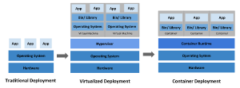
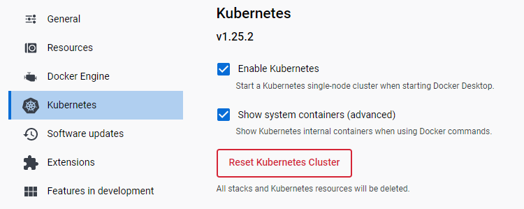
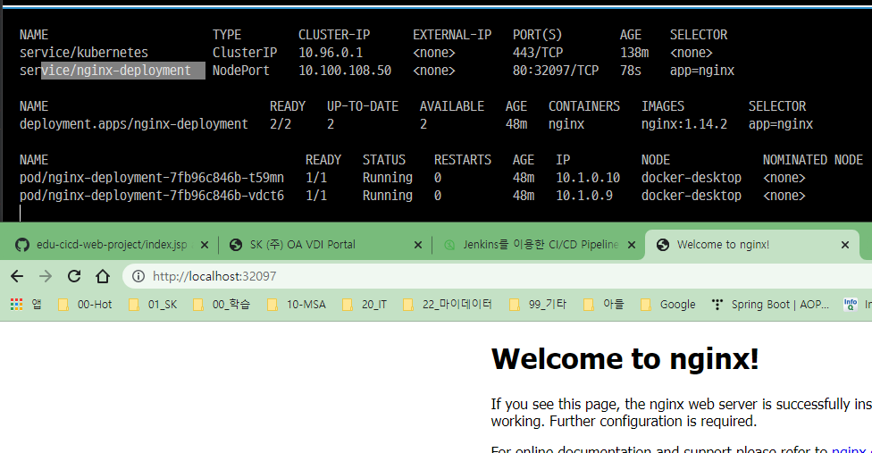
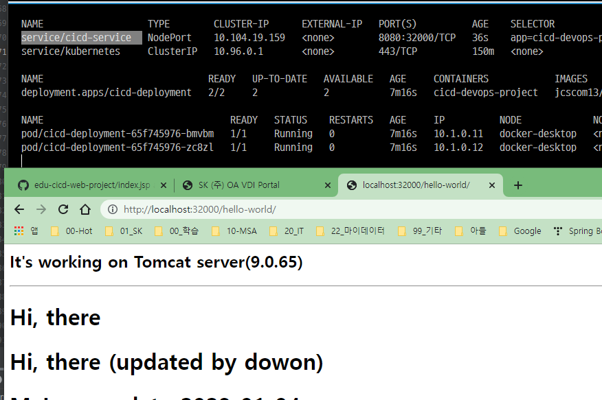
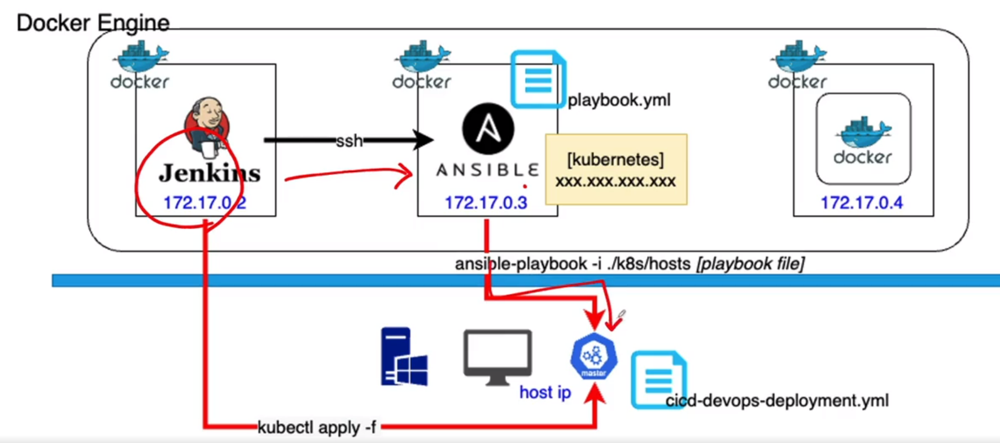
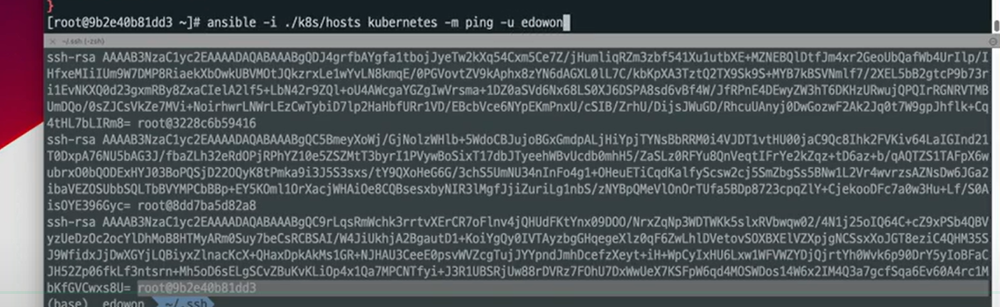
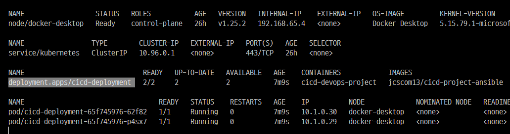
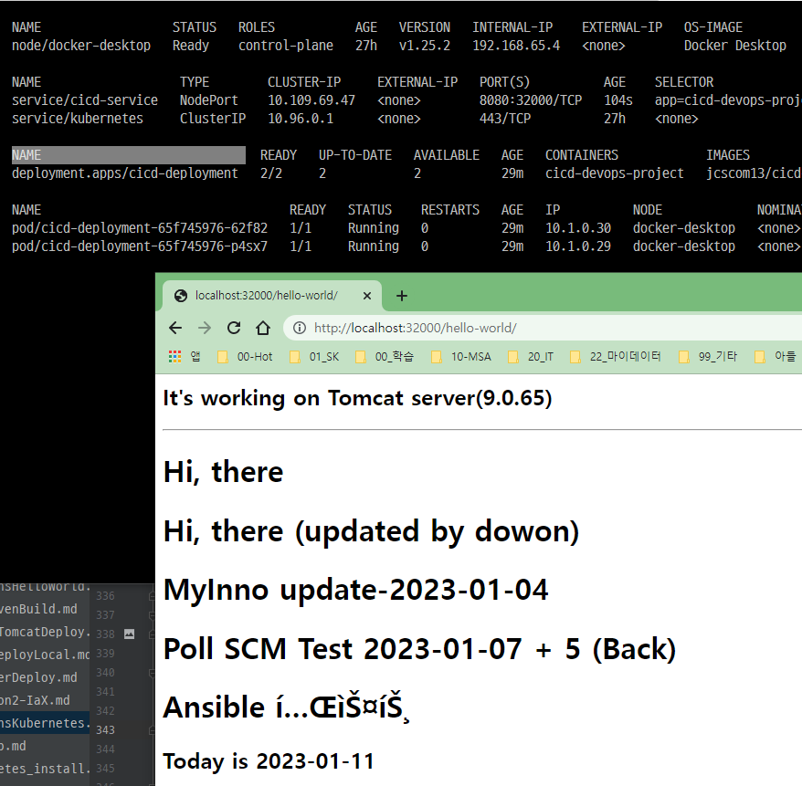
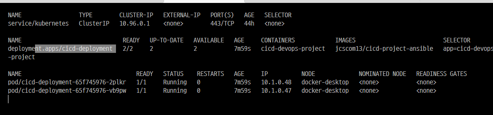
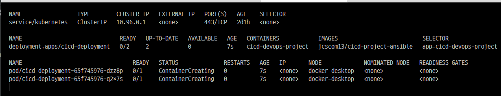

<style>
.burk {
    background-color: red;
    color: yellow;
    display:inline-block;
}
</style>

# Section 4: Jenkins + Ansible + Kubernetes 연동

Kubernetes Cluster
Kubernetes 설치 (Minikube)
Kubernetes Cluster에 배포하기
Ansible + Kubernetes 연동
CI/CD 프로세스

## 1. Kubernetes 소개

### Container Virtualization

https://kubernetes.io/docs/concepts/overview/

- 

CNCF Cloud Native Interactive Landscape

- https://landscape.cncf.io/
- Kubernetes(K8s)
  - 오픈소스 기반의 컨테이너화 된 애플리케이션(워크로드와 서비스)의 자동 배포, 스케일링 등을 제공하는 관리 플랫폼

### Kubernetes

제공하는 기능

- 컨테이너화 된 애플리케이션 구동
- 서비스 디스커버리와 로드 밸런싱
- 스토리지 오케스트레이션
- 자동화된 롤아웃과 롤백
- 자동화된 빈 패킹(bin packing)
- 자동화된 복구(self-healing)
- 시크릿과 구성 관리

미 제공

- 소스 코드 배포 X, 빌드 X
- 애플리케이션 레벨 서비스 X
- 로깅, 모니터링 솔루션 X
- 포괄적인 머신 설정, 유지보수, 관리, 자동 복구 시스템을 제공 X

## 2. Kubernetes 설치

- kubernetes_install.md ==> 참조

docker desktop에 있는 kubernetes을 이용하여 테스트

- 

## 3. Kubernetes 기본 명령어

Namespace

- 가상의 네트워크 공간

K8s 기본 명령어

노드 확인

- kubectl get nodes

파드 확인

- kubectl get pos

디플로이먼트 확인

- kubectl get deployments

서비스 확인

- kubectl get services

Nginx 서버 실행

- kubectl run sample-nginx --image=nginx --port=80

컨테이너 정보 확인

- kubectl describe pod/sample-nginx

파드 삭제

- kubectl delete pod/sample-nginx-XXXXX-XXXXX

Scale 변경 (2개로 변경)

- kubectl create deployment sample-nginx --image=nginx --port=80
- kubectl scale deployment sample-nginx --replicas=2
- deployment로 생성하면 pod을 삭제하면 자동으로 다시 생성됨

Script 실행

- kubectl apply -f sample1.yml
  ```yaml
  apiVersion: apps/v1
  kind: Deployment
  metadata:
    name: nginx-deployment
    labels:
      app: nginx
  spec:
    replicas: 2
    selector:
      matchLabels:
        app: nginx
    template:
      metadata:
        labels:
          app: nginx
      spec:
        containers:
        - name: nginx
          image: nginx:1.14.2
          ports:
          - containerPort: 80
  ```

## 4. Kubernetes Script 파일

파드 확인

- kubectl get pos -o wide

파드에 터널링으로 접속

- kubectl exec -it nginx-deployment-XXXX-XXXX -- /bin/bas

파드 노출(공개)

- kubectl expose deployment nginx-deployment --port=80 --type=NodePort
- 

### cicd-project-ansible

cicd-project-ansible 도커 이미지를 kubernetes 에서 서비스 하기
1. cicd-devops-deployment.yml
   - kubectl apply -f    cicd-devops-deployment.yml
    ```yaml
    apiVersion: apps/v1
    kind: Deployment
    metadata:
      name: cicd-deployment
    spec:
      selector:
        matchLabels:
          app: cicd-devops-project
      replicas: 2
  
      template:
        metadata:
          labels:
            app: cicd-devops-project
        spec:
          containers:
            - name: cicd-devops-project
              image: jcscom13/cicd-project-ansible
              imagePullPolicy: Always
              ports:
                - containerPort: 8080
    ```
2. 서비스 실행
  - kubectl apply -f  cicd-devops-service.yml
  - cicd-devops-service.yml
    ```yaml
    apiVersion: v1
    kind: Service
    metadata:
      name: cicd-service
      labels:
        app: cicd-devops-project
    spec:
      selector:
        app: cicd-devops-project
      type: NodePort
      ports:
        - port: 8080
          targetPort: 8080
          nodePort: 32000
    ```
   - 

강의 스크립트

  ```shell
  소스 코드
  vi sample1.yml
  https://github.com/joneconsulting/jenkins_cicd_script/blob/master/k8s_script/sample1.yml
  vi cicd-devops-deployment.yml
  https://github.com/joneconsulting/jenkins_cicd_script/blob/master/k8s_script/cicd-devops-deployment.yml
  vi cicd-devops-service.yml
  https://github.com/joneconsulting/jenkins_cicd_script/blob/master/k8s_script/cicd-devops-service.yml
  ```

## 5. Kubernetes + Ansible 연동
연동 흐름
- 


1. Ansible Server) k8s-master 접속 테스트
    ```shell
    $ docker exec -it my-ansible bash
    [root@aafae14db5b5 ~]# ssh administrator@172.28.128.1
    administrator@172.28.128.1's password:
   ```
   - window ssh 서버 설치 필요 (PowerShell을 관리자로 실행)
     - https://learn.microsoft.com/en-us/windows-server/administration/openssh/openssh_install_firstuse?tabs=powershell
    ```shell
    #1. window 접속 계정에 비번 설정
    #2. 설치 여부 확인
    Get-WindowsCapability -Online | Where-Object Name -like 'OpenSSH*'
    
    #3-1. Install the OpenSSH Client
    Add-WindowsCapability -Online -Name OpenSSH.Client~~~~0.0.1.0
    
    #3-2. Install the OpenSSH Server
    Add-WindowsCapability -Online -Name OpenSSH.Server~~~~0.0.1.0
    
    # 4. 서비스 기동
    ## Start the sshd service
    Start-Service sshd
    
    ## OPTIONAL but recommended:
    Set-Service -Name sshd -StartupType 'Automatic'
    
    ## Confirm the Firewall rule is configured. It should be created automatically by setup. Run the following to verify
    if (!(Get-NetFirewallRule -Name "OpenSSH-Server-In-TCP" -ErrorAction SilentlyContinue | Select-Object Name, Enabled)) {
        Write-Output "Firewall Rule 'OpenSSH-Server-In-TCP' does not exist, creating it..."
        New-NetFirewallRule -Name 'OpenSSH-Server-In-TCP' -DisplayName 'OpenSSH Server (sshd)' -Enabled True -Direction Inbound -Protocol TCP -Action Allow -LocalPort 22
    } else {
        Write-Output "Firewall rule 'OpenSSH-Server-In-TCP' has been created and exists."
    }
    ```
2. hosts파잏 (ansible 서버)
   - /home/ansible-k8s/hosts 
    ```shell
    [ansible]
    ansible
    [kubernetes]
    172.28.128.1
    ```
3. Ansible Server) ssh-keygen, ssh-copy-id
   - ssh 연결시 비번없이 연동(ansible서버에서) 
   - [참조](https://medium.com/@ramon.solodezaldivar/how-to-establish-a-passwordless-ssh-s-connection-between-windows-and-linux-c75a948513b2)
    ```shell  
    #ansible 서버에서  (100.200.0.1 오류, 10.250.141.157정상)
    cd /root/.ssh
    scp id_rsa.pub administrator@10.250.141.157:C:/ProgramData/ssh/administrators_authorized_keys
    # 파일이 Window에 복사되었는지 확인 바람
    # "\"로 했을떄도 100%로 오류가 표시되지 않으나 파일이 복사되지 않음 (참조 Site와 변경한 부분)
    
    #Window에서
    icacls.exe "C:\ProgramData\ssh\administrators_authorized_keys" /inheritance:r /grant "Administrators:F" /grant "SYSTEM:F"
    
    Restart-Service -Name sshd, ssh-agent -Force
    
    #ansible 서버에서(passwordless로 접속됨)
    [root@aafae14db5b5 .ssh]# ssh administrator@10.250.141.157
    Microsoft Windows [Version 10.0.19042.2364]
    (c) Microsoft Corporation. All rights reserved.
    
    administrator@SKCC22N00521 C:\Users\Administrator>
    ```
4. window서버에 ansible 모듈 테스트
   - https://www.inflearn.com/questions/686434/ssh-copy-id-%EC%97%90%EB%9F%AC-%EB%AC%B8%EC%9D%98
    ```shell
    #1. ansible-server에서
    $ yum install python39
    $ pip install pywinrm 
    
    #2. ansible-server ->  Hosts 파일 수정
    [ansible]
    ansible
    [win_kubernetes]
    10.250.141.157    
    [win_kubernetes:vars]
    ansible_password='1q2w3e4r%T'
    ansible_connection=winrm
    ansible_winrm_server_cert_validation=ignore
    ansible_user=administrator
    ansible_port=5986
    
    #3. kubernetes가 기동되는 window서버  (powershell로 수행)
    $url = "https://raw.githubusercontent.com/ansible/ansible/devel/examples/scripts/ConfigureRemotingForAnsible.ps1"
    
    $file = "$env:temp\ConfigureRemotingForAnsible.ps1"
    
    (New-Object -TypeName System.Net.WebClient).DownloadFile($url, $file)
    
    powershell.exe -ExecutionPolicy ByPass -File $file
    
    #4. ansible 모듈 테스트
    [root@aafae14db5b5 ansible-k8s]# ansible -i ./hosts win_kubernetes -m win_ping
    [WARNING]: Found both group and host with same name: ansible
    172.28.128.1 | SUCCESS => {
        "changed": false,
        "ping": "pong"
    }
    ``` 
   - 계정을 지정하는 case : -u 계정명
     - 
## 6. Ansible에서 Kubernetes 제어하기
1. K8s Master) create a deployment yaml file
   - d:\APP\@inflearn\202212-JenkinsCICD\k8sTest\A20-test\cicd-devops-deployment.yml
   - 다운로드 파일에서 이미지 계정만 변경
2. Ansible Server) create a playbook file for deployment
   - window에서 run하기 위해 command --> win_command로 변경 
    ```shell
    - name: Create pods using deployment 
      hosts: win_kubernetes 
      # become: true
      # user: ubuntu
     
      tasks: 
    #  - name: delete the previous deployment
    #    command: kubectl delete deployment.apps/cicd-deployment
    
      - name: create a deployment
        win_command: kubectl apply -f cicd-devops-deployment.yml
        args: 
            chdir: d:\APP\@inflearn\202212-JenkinsCICD\k8sTest\A20-test
    ```
  - run
    ```shell
    [root@aafae14db5b5 ansible-k8s]# pwd
    /home/ansible-k8s
    [root@aafae14db5b5 ansible-k8s]# ansible-playbook -i ./hosts k8s-cicd-deployment-playbook.yml
    ```
  - 결과
    - 

3. 서비스 기동
   - [root@aafae14db5b5 ansible-k8s]# ansible-playbook -i ./hosts k8s-cicd-service-playbook.yml
   - d:\APP\@inflearn\202212-JenkinsCICD\k8sTest\A20-test\cicd-devops-service.yml
   - 


## 7. Ansible playbook으로 Kubernetes Script 실행하기

### jenkins에서 kubernetes 연동하기
1. 환경설정 (kubernetes 서버 ssh 설정 추가)
   - Manage Jenkins > Configure System > Publish over SSH
      - Add SSH Servers
      - Name: k8s-master
      - Hostname: [k8s-master’s IP] ex)172.28.128.1
      - Username: root
      - Passphrase/Password: Vagrant
      - Port: 22
      - Test Configuration

2. 프로젝트 설정
   - Item name : 06-My-K8s-Project
     - Copy from: My-Ansible-Project
     - Post-build Actions
       - SSH Server: k8s-master   (기존것은 삭제: 시간이 많이 소비)
     - Exec command   : 일단 yaml파일을 full path로 테스트
       - kubectl apply -f d:\APP\@inflearn\202212-JenkinsCICD\k8sTest\A20-test\cicd-devops-deployment.yml
     - Build Now
   - 처리 결과 
     - 

### jenkins에서 ansible을 통하여 kubernetes 연동하기
1. docker를 restart 했다면 다시 작업하는 내용
   1. ansible

      ```shell
      #1. docker ps 확인
          systemctl start docker
      #2. ssh-keygen   (이전 생성했던 내역 초기화)  --> 다음에는 root폴더를 공유하지
      #3. ssh-copy-id root@ansible -f
          ssh-copy-id root@worker01 -f
      #4. ansible 확인
          ansible-playbook -i hosts create-cicd-project-image-playbook.yml    <-- /home/ansible
      ```
   2. window 서버를 위한 ansible 서버 추가 작업
      ```shell
      window서버에 ansible 모듈 테스트 <== 이부분 찾아서 확인
      ```
2. 프로젝트 생성
  - item: 07-My-K8s-Project-using-Ansible
    - Copy from: 05-My-Ansible-Project.
    - Post-build Actions
      - SSH Server: ansible-host
        - Exec command
          - ansible-playbook -i ./k8s/hosts k8s-cicd-deployment-playbook.yml
     - Append exec commands
      ```shell
      cd /home/ansible;
      ansible-playbook -i hosts create-cicd-project-image-playbook.yml;
      cd /home/ansible-k8s;
      ansible-playbook -i hosts k8s-cicd-deployment-playbook.yml
      ```
  - Build Now

  - 배포 이후 Kubernetes 실행 
    - 

### 실습7) Jenkins + Ansible + Kubernetes 연동하기 ①

### 실습7) Jenkins + Ansible + Kubernetes 연동하기 ②

## 8. 전체 CI/CD 자동화 프로세스 구성

### 실습8) Jenkins를 이용한 CI/CD 자동화 파이프라인 구축하기 ①

### 실습8) Jenkins를 이용한 CI/CD 자동화 파이프라인 구축하기 ②

## Z. 기타 기능

### Git bash에서 watch 기능 사용하기

vi watch (shell 파일 생성)

- https://gist.github.com/espaciomore/28e24ce4f91177c0964f4f67bb5c5fda
- /usr/bin에 생성
  ```shell
  #!/bin/bash
  ARGS="${@}"
  clear;
  while(true); do
    clear
    OUTPUT=`$ARGS`
    echo -e "${OUTPUT[@]}"
    sleep 1
  done
  ```

실행예시

```shell
Administrator@SKCC22N00521 MINGW64 ~
$ watch kubectl get service,deploy,pods -o wide
```


### findstr
window에서 grep

docker ps -a | findstr ansible