<style>
.burk {
    background-color: red;
    color: yellow;
    display:inline-block;
}
</style>

# Section 4: CI/CD Pipeline 구축

- Delivery Pipeline 사용
- Jenkins Pipeline 구성
- SonarQube 사용
- Jenkins + SonarQube 연동
- Jenkins Master + Slaves 구성

## 1. Delivery Pipeline 사용
1. 3개의 개별 Item을 하나로 연결
   - Create a Pipeline
   - 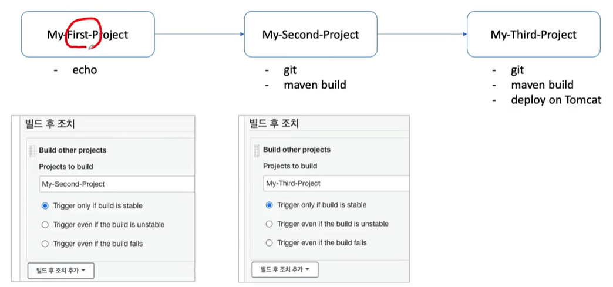

2. 시각화를 위한  pipeline 구성 - 환경 추가
   - Manage Jenkins > Plugin Manager > Available
     - Delivery Pipeline
     - 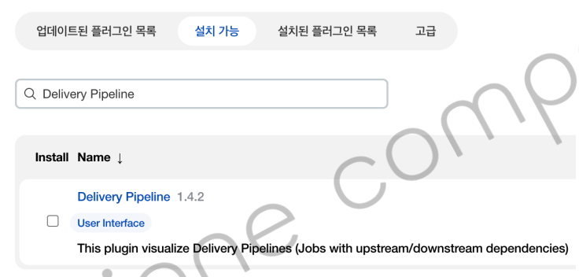
3. View 구성
   -  Dashboard > My Views > '+'  (New View 생성)
     - 조회명: A01-My-First-Pipeline 
     - Delivery Pipeline View 선택
   - Pipelines
     - Name: My-Pipeline
     - Inital-Job: 01-My-First-Project

   - 결과 확인
     - 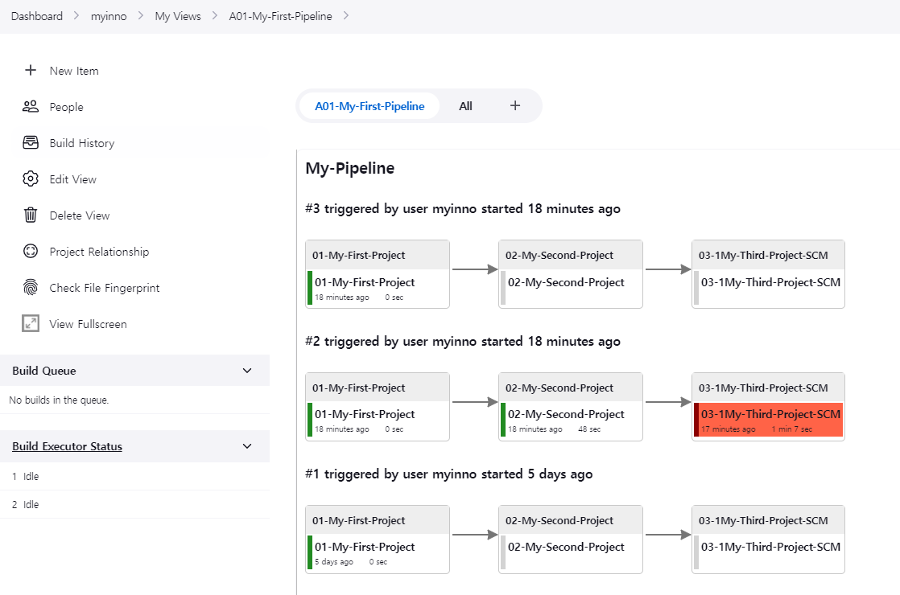

## 2. Jenkins Pipeline
### Jenkins Pipeline
1. 종류
   - Declarative
   - Scripted (Groovy + DSL: Domain Specified Language) 
   - 차이점
     - 시작 시 유효성 검사 유무
     - 특정 Stage 실행 가능 여부
     - 제어문
     - Option

2. Declarative
   - Groovy script 없이 간단하게 시작
   - 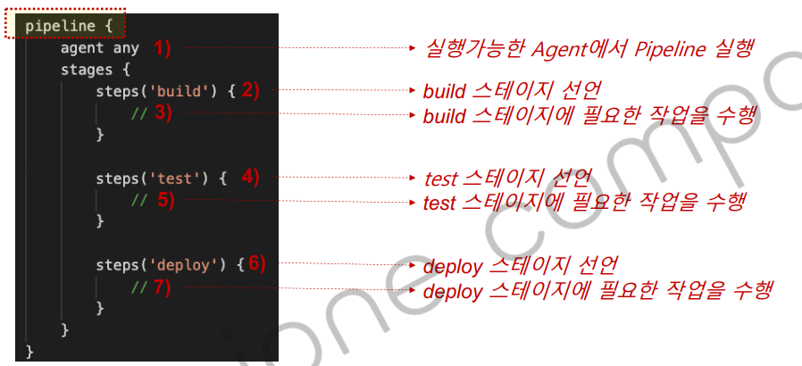

### 실습9) Jenkins Pipeline 생성하기
1. 간단 생성
   - Item name: B1-My-First-Pipeline
     Pipeline
     - Script    <-- pipeline_sample1.yml 내용 복사 
   - Build Now
     - 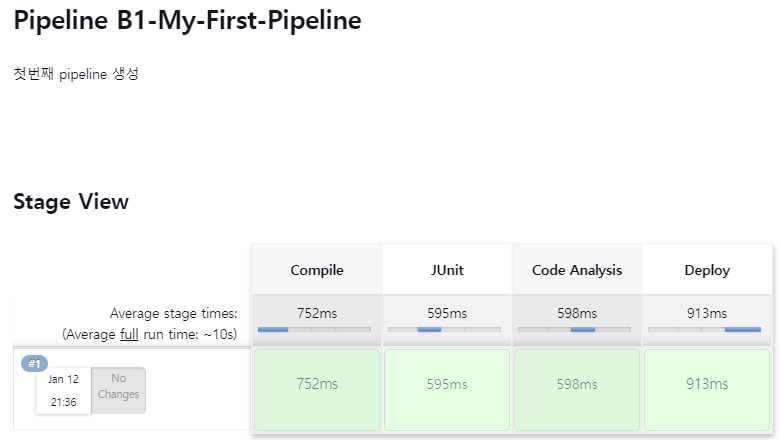
2. Script 추가
   - post  (기존 script의 stages 뒤에 추가) : pipeline_sample2.yml
    ```shell
        post {
          always {
            echo "This will always run"
          }
          success {
            echo "This will run when the run finished successfully"
          }
          failure {
            echo "This will run if failed"
          }
          unstable {
            echo "This will run when the run was marked as unstable"
          }
          changed {
            echo "This will run when the state of the pipeline has changed"
          }
        }
    ```

### 실습10) Jenkins Pipeline 프로젝트 - Pipeline Syntax 사용

1. Github에 저장된 Script 실행
  - git 'https://github.com/myinno/edu_jenkins_pipeline_script';  (본인 계정)

   - Script : pipeline_sample3.yml

### 실습11) Jenkins Pipeline 프로젝트 - Maven build pipeline
이전에 작업했던 cicd-web-project 예제를 Maven 빌드 하기
- pipeline_sample4_exercies11.yml
  ```shell
  pipeline {
      agent any
      tools { 
        maven 'Maven3.8.5'
      }
      stages {
          stage('github clone') {
              steps {
                  git branch: 'main', url: 'https://github.com/myinno/edu-cicd-web-project.git'; 
              }
          }
          
          stage('build') {
              steps {
                  sh '''
                      echo build start
                      mvn clean compile package -DskipTests=true
                  '''
              }
          }
      }
  }
  ```
### 실습12) Jenkins Pipeline 프로젝트 - Tomcat 서버에 배포
Exercise 11번 작업의 결과물을 tomcat9 서버에 배포하기

1. Pipeline Syntax
 
   - 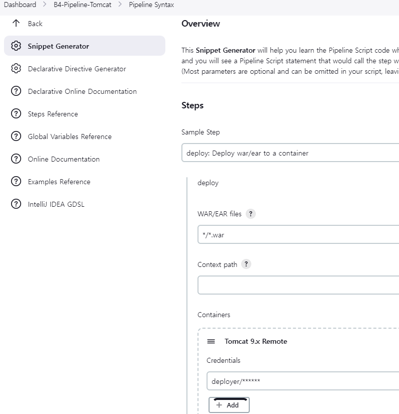

2. pipeline 반영
```shell
pipeline {
    agent any
    tools { 
      maven 'Maven3.8.5'
    }
    stages {
        stage('github clone') {
            steps {
                git branch: 'main', url: 'https://github.com/myinno/edu-cicd-web-project.git'; 
            }
        }
        
        stage('build') {
            steps {
                sh '''
                    echo build start
                    mvn clean compile package -DskipTests=true
                '''
            }
        }
        stage('deploy') {
            steps {
                sh '''
                    echo deploy start
                    deploy adapters: [tomcat9(credentialsId: 'deployer_user', path: '', url: 'http://10.200.0.1:8099')], contextPath: null, war: '*/*.war'
                '''
            }
        }
    }
    
}
```


### 실습13) Jenkins Pipeline 프로젝트 - Docker 컨테이너에 배포


## 3. SonarQube

1. SonarQube 개요
  - https://www.sonarqube.org/
  - Continuous Integration + Analysis
    - Code Quality Assurance tool à Issues + Defect + Code Complexity
    - Detect Bugs & Vulnerabilities
    - Track Code Smells
  - Code Quality Metrics & History
  - 17 languages 지원
    - Java, C#, JavaScript, TypeScript, CloudFormation, Terraform, Kotlin, Ruby, Go, Scala, Flex, Python, PHP, HTML, CSS, XML, VB.NET
  - CI/CD integration
  - Extensible, with 50+ community plugins

2. SonarQube 설치 (도커)
  -  $ docker run  -p 9000:9000 --name sonarqube sonarqube
  - http://localhost:9000   admin/admin으로 접속
    -  이후 비번 변경 (my****)

### Exercise 15 # Bad code detected & Rectified 1/3
SonaQube을 적용한 프로젝트 구성
1. Sonaqube 토큰 생성
  - Maven에서 접속하기 위하여

    ```shell
    #1. sonaqube 젒속(http://localhost:9000)
    #2 "A"을 선택 --> My Account --> Token 생성
       생성된 Token은 별도 보관 필요  
       name:sonarqube-token       sqa_d2a8bddb15e03733695df3ef15b00f19a5280b16
    ``` 
    -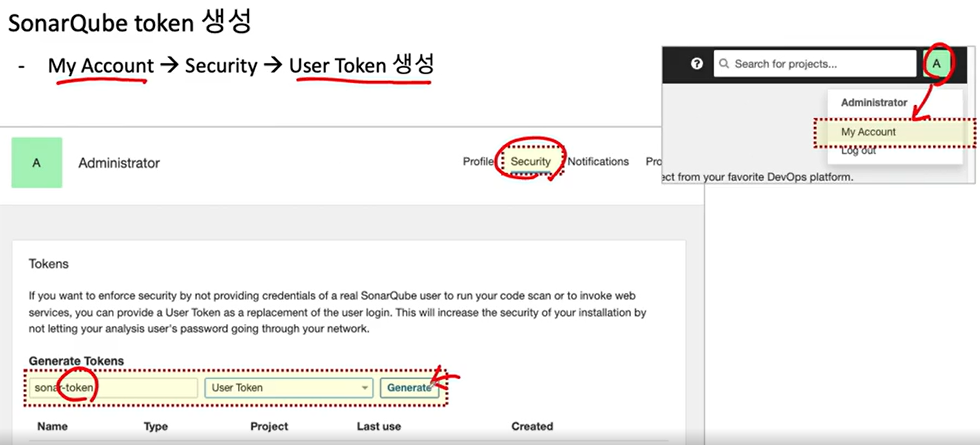 
2. Maven에 SonarQube 관련 플러그인 추가
   - Maven Project에 Plugin 설정 추가
     - https://docs.sonarqube.org/latest/analysis/scan/sonarscanner-for-maven/
     - 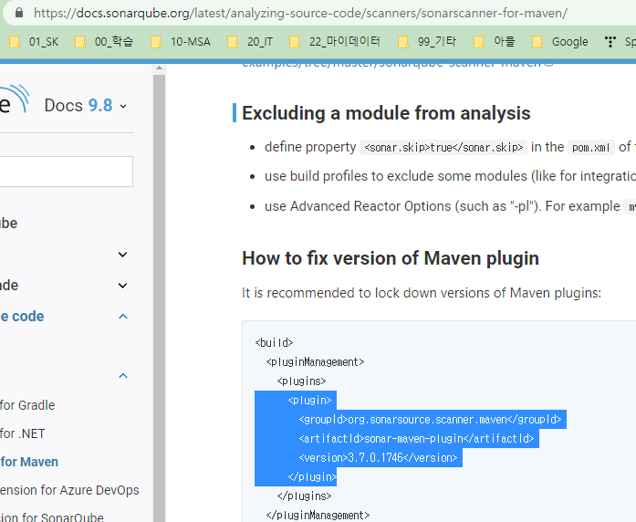
     - plugin 부분을 maven pom.xml에 추가
         ```shell
         <plugin>
           <groupId>org.sonarsource.scanner.maven</groupId>
           <artifactId>sonar-maven-plugin</artifactId>
           <version>3.7.0.1746</version>
         </plugin>
         ```
3. SonarQube을 적용한 Maven 빌드

   - Maven build
    ```shell
    $ mvn sonar:sonar -Dsonar.host.url=http://IP_address:9000 -Dsonar.login=[the-sonar-token]
    $ mvn sonar:sonar -Dsonar.host.url=http://10.250.141.157:9000 -Dsonar.login=squ_b89d56ec515caaa93.......
    ```
   - Maven 빌드하면 SonarQube로 전달됨
     - 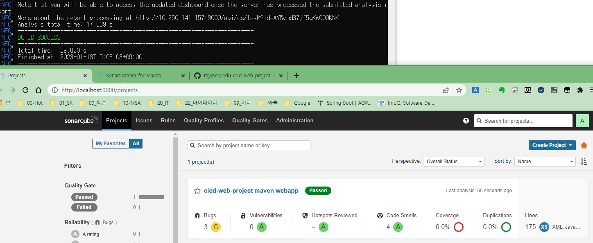


### 실습15) Bad code 조사하기
프로그램에 "system.out.println()"을 추가하고 빌드 해보자

1. 임의 java 프로그램ㅇ에 "System.out"추가

    ```java
        @Override
        protected Class<?>[] getServletConfigClasses() {
        System.out.println("Sonar Test...")
            return new Class[]{SpringConfig.class};
        }
    ```

2. Maven 빌드
   -  오류시 
     
      ```shell
       $ mvn clean compile package –DskipTests=true
       $ mvn sonar:sonar -Dsonar.host.url=http://IP:9000 -Dsonar.login=[the-sonar-token]
       $ mvn sonar:sonar -Dsonar.host.url=http://10.250.141.157:9000 -Dsonar.login=squ_b89d56ec515caaa9367afcf215b2516a51c091d0
       ```
       - 결과 확인
         - 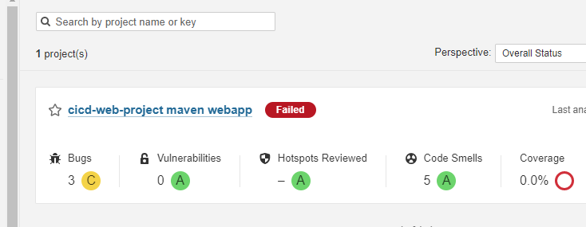
3. 소스를 정상으로 수정하고 다시 확인

ㅌ
## 4. Jenkins + SonarQube 연동

1. SonarQube Plugin 설치
   -  Manage Jenkins > Manage Plugins > Available
     - SonarQube Scanner 설치
     - 설치 완료후 Restart                                       yy676/88fdfcv
2. SonarQube 접속 token등록
   - Manage Jenkins > Manage Credentials > Add Credentials
   - Dashboard >   Manage Jenkins >   Credentials >  System  >  Global credentials (unrestricted)
     - Kind: crcret text
     - Secret: Sonar Qube Token
     - id: sonarqube-token

3. SonarQube servers 설정
   - Manage Jenkins > Configure System > SonarQube servers
     - Environment variables 선택
     - Name: SonarQube 서버의 이름지정
     - Server URL: SonarQube 서버의 IP address
     - Server authentication token: Credentials에서 지정한 Token 정보
     - 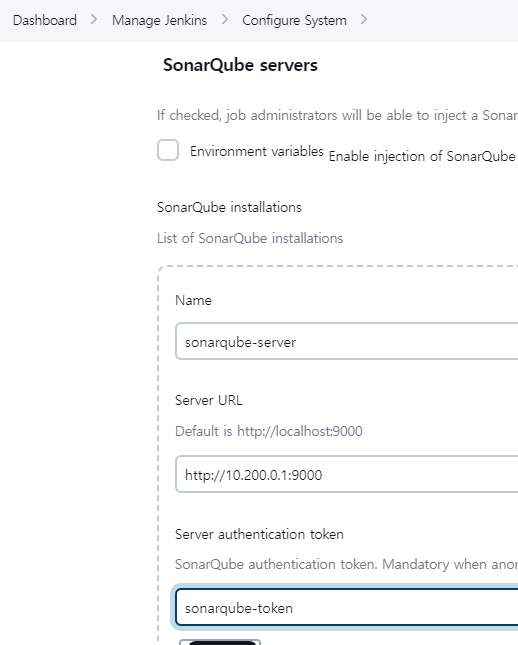

4. 프로젝트 셍성
   - Item Name: C1-SornarQube-FIrst
     - Copy: B3-.....

   -  아래 step 추가

    ```shell
             stage('SonarQube Analysis') {
                steps {
                    withSonarQubeEnv('sonarqube-server') {
                        sh 'mvn sonar:sonar'
                    }
                }
            }
    ```

## 4. Jenkins Master + Slaves
Jenkins Master
- 기본 Jenkins 서버 > Master node
- 빌드 작업 예약 및 빌드 실행
- Slave에게 Build 할 Job 전달
- Slave 모니터링
- 빌드 결과 기록

Jenkins Slave
- Remote에서 실행되는 Jenkins 실행 Node
- Jenkins Master의 요청 처리
- Master로부터 전달된 Job 실행
- 다양한 운영체제에서 실행 가능
- Jenkins 프로젝트 생성 시 특정 Slave를 선택하여 실행 가능
  - 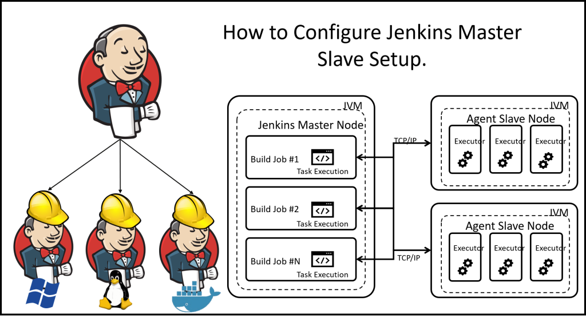
  - https://digitalvarys.com/how-to-configure-jenkins-master-slave-setup/

### Exercise 17 # Add a slave node 1/3

1. 새로운 Server 추가(docker)
   - Windows, MacOS)
     - 위치:d:\APP\@inflearn\202212-JenkinsCICD\envsystem\jenkins-slave\
    ```shell
    docker build -t jcscom13/my-slave:1.0 -f Dockerfile_jenkins_slave .
    
    docker run --privileged --name jenkins-node1 -it -p 30022:22 \
    -e container=docker -v /sys/fs/cgroup:/sys/fs/cgroup --cgroupns=host \
    jcscom13/my-slave:1.0 /usr/sbin/init    
    ```

2. New Node 추가
    ```shell
    Manage Jenkins > Manage Nodes > New Node
    - Node Name: slave1
    - Description: Add a server as a slave machine
    - Number of executors: 5
    - Remote root directory: /root/slave1
    - Labels: slave1   #  Pipeline에서 여기를 지정
    - Usage: Use this node as much as possible
    - Launch method: Launch agents via SSH
      - Host: [Slave server IP address] es) 172.17.0.3
      - Port: 22
      - Credentials: root/P@ssw0rd
    ```
3. My-First-Project 수정
   - item: C2-node-01 
     - copy: 01-My-First-Project
   - Restrict where this project can be run 선택
     - 여기를 "slave1"을 지정 <== Labels에서 지정한 이름
     - 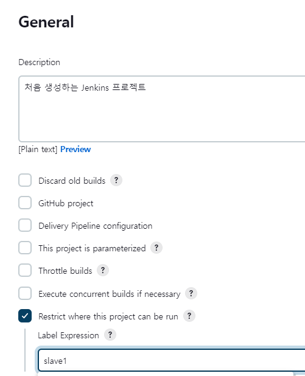
4. slave1 노드에 추가 설치

    ```shell
    yum install -y ncurses git
    
    yum list java*jdk-devel
    yum install  java-11-openjdk-devel.x86_64
    ```
5. 프로젝트 기동 
   - slave에서 실행된 내역 확인


       


### Exercise 18 # Execute a pipeline on slaves

1. 프로젝트 생성
   - New Item :C3-Slave-Pipeline
     - Copy from: B3-PipelineMaven
   - 스크립터 수정(기존 agent는 any로 되어 있었음)
    ```shell
        agent {
            label 'slave1'
        }
    ```
