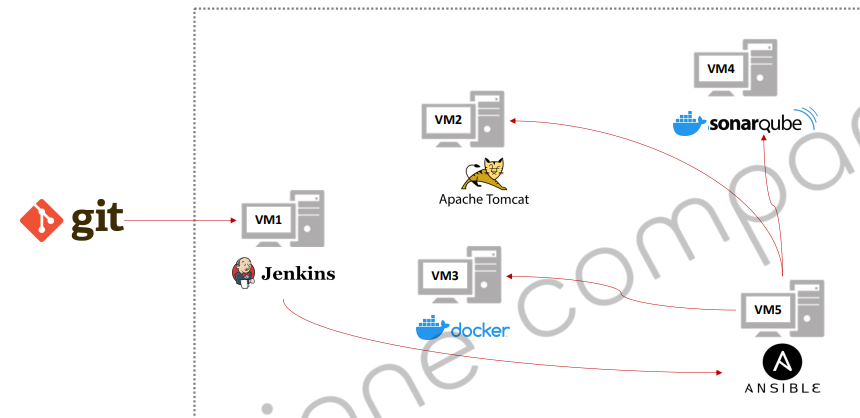

# A40-Section 4: CI/CD Pipeline 구축

- AWS Cloud 실습 환경 구성도
- AWS EC2에 서비스 생성
- Tomcat 서버에 배포
- Docker 서버에 배포
- Ansible 서버에 배포

## 1. AWS Cloud 실습 환경 구성도
AWS Cloud 실습 환경 구성도
- 
- 

### Install Jenkins on EC2
Maven 설치
- http://maven.apache.org/download.cgi à apache-maven-3.8.6-bin.tar.gz
  $ sudo amazon-linux-extras install epel -y
  $ cd /opt
  $ ls -ltr
  $ wget https://mirror.navercorp.com/apache/maven/maven-3/3.8.6/binaries/apache-maven-3.8.6-bin.tar.gz
  $ tar –xvzf apache-maven-3.8.6-bin.tar.gz
  $ mv apache-maven-3.8.6-bin.tar.gz maven
  $ cd maven/
  $ vi ~/.bash_profile
  M2_HOME=/opt/maven
  M2=/opt/maven/bin
  PATH=$PATH:$M2:$M2_HOME

Jenkins 설치
- https://pkg.jenkins.io/redhat-stable/
  $ sudo amazon-linux-extras install epel -y
  $ sudo wget -O /etc/yum.repos.d/jenkins.repo https://pkg.jenkins.io/redhat-stable/jenkins.repo
  $ sudo rpm --import https://pkg.jenkins.io/redhat-stable/jenkins.io.key
  $ sudo yum install jenkins
  § Jenkins Test
- http://[public ip address]:8080/

cat /var/lib/jenkins/secrets/initialAdminPassword
- 비밀번호 입력 후 로그인 à 설치 계속
- Jenkins > admin > Configure > Change password

§ AWS의 EC2에 Docker Server 설치
$ sudo amazon-linux-extras install epel -y
$ sudo yum intall –y docker
§ Docker Test
$ docker –version
§ Start Docker
$ sudo usermod –aG docker ec2-user (인스턴스 재 접속)
$ sudo service docker start
$ docker run hello-world

AWS의 EC2에 Tomcat Server 설치
- https://tomcat.apache.org/download-90.cgi à apache-tomcat-9.0.65.tar.gz
  $ sudo amazon-linux-extras install epel -y
  $ cd /opt
  $ wget https://mirror.navercorp.com/apache/tomcat/tomcat-9/v9.0.65/bin/apache-tomcat-9.0.65.tar.gz
  $ tar –xvzf apache-tomcat-9.0.65.tar.gz
  $ chmod +x /opt/apache-tomcat-9.0.65.tar.gz
  $ ln –s /opt/apache-tomcat-9.0.65/bin/startup.sh /usr/local/bin/tomcat_startup
  $ ln –s /opt/apache-tomcat-9.0.65/bin/shutdown.sh /usr/local/bin/tomcat_shutdown
  § Tomcat Test
- http://[public ip address]:8080/

§ AWS의 EC2에 Ansible Server 설치
$ sudo amazon-linux-extras install epel -y
$ sudo yum install –y ansible
$ ssh-keygen
$ ssh-copy-id ec2-user@[ec2_ip_address] à Tomcat Server, Docker Server
§ Ansible Test
$ ssh ec2-user@[ec2_ip_address]

SonarQube 설치
$ sudo amazon-linux-extras install epel -y
$ sudo mkdir /opt/sonarqube
$ cd /opt/sonarqube
$ sudo wget https://binaries.sonarsource.com/Distribution/sonarqube/sonarqube-7.6.zip
$ sudo unzip sonarqube-7.6.zip
$ sudo chown -R ec2-user:ec2-user /opt/sonarqube/
§ SonarQube 실행
$ ./bin/[사용하는 OS]/sonar.sh start
§ SonarQube 테스트
- http://[public ip address]:9000/
  § https://github.com/joneconsulting/k8s/blob/master/install/kubernetes_install.md

## 2. AWS EC2에 서비스 생성
## 3. Tomcat 서버에 배포
## 4. Docker 서버에 배포
## 5. Ansible 서버에 배포
