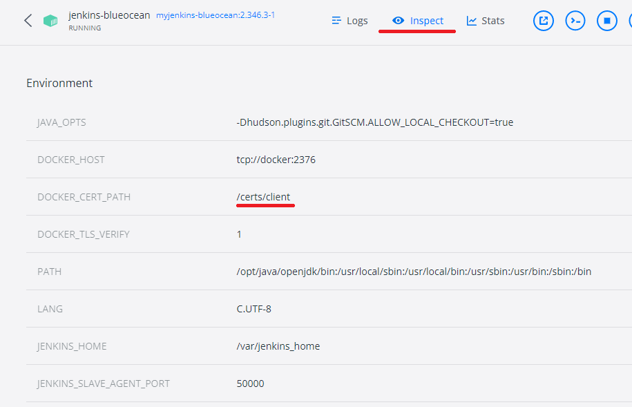

<style>
.burk {
    background-color: red;
    color: yellow;
    display:inline-block;
}
</style>
# 도커 기반 Jenkins
- 도커 기반 Jenkins 설정
- 주요 참조 문서
  - https://www.jenkins.io/doc/tutorials/build-a-java-app-with-maven/
- 설치 환경:노트북, window10
- <span class=burk>회사 네크워크 확경에서 발생하는 "x509" 오류는 "https://auth.docker.io"예외 등록 후 정상 처리됨</span>
  - 이수정(20009791@partner.....) 현장대리인에게 요청함
## 1. 환경 설정

Docker기반으로 Jenkins 설정

1. Docker에서 브리지 네트워크 만들기
    - Jenkins을 실행하는 도커에서 다른(ex:Maven)등을 Docker기반으로 동작하기 위하여
    - 2개의 Docker 이미지간 통신을 위한 네트워크 설정
    ```bash
    # 생성 스크립트
    docker network create jenkins
    ```
    ```bash
    # (참고)삭제 스크립트
    docker network rm jenkins
    # 리스트
    docker network ls
    ```
2. docker:dind Docker 이미지 실행
   - Pipeline상에서 Maven등을 별도 설치하지 않고 Docker로 실행할떄 이용하는 도커
   - "docker:dind"을 별도 부록으로 추가 정리하자(TODO)
    ```bash
    docker run --name jenkins-docker --rm --detach ^
      --privileged --network jenkins --network-alias docker ^
      --env DOCKER_TLS_CERTDIR=/certs ^
      --volume jenkins-docker-certs:/certs/client ^
      --volume jenkins-data:/var/jenkins_home ^
      --publish 2376:2376 ^
      docker:dind
    ```
   - <span class=burk>실행후 Docker의 "Environment"
     - DOCKER_TLS_CERTDIR: /certs  확인 필요
     - git bash 창에서 수행하면 "C:/Program Files/Git/certs"로 설정됨
     - 왜 설정이 안되는지는 확인 안됨 </span>

3. Jenkins Docker 생성
   - Dockerfile (d:\APP\@inflearn\202212-JenkinsCICD\환경구성)
        ```bash
        FROM jenkins/jenkins:2.346.3-jdk11
        USER root
        RUN apt-get update && apt-get install -y lsb-release
        RUN curl -fsSLo /usr/share/keyrings/docker-archive-keyring.asc \
        https://download.docker.com/linux/debian/gpg
        RUN echo "deb [arch=$(dpkg --print-architecture) \
        signed-by=/usr/share/keyrings/docker-archive-keyring.asc] \
        https://download.docker.com/linux/debian \
        $(lsb_release -cs) stable" > /etc/apt/sources.list.d/docker.list
        RUN apt-get update && apt-get install -y docker-ce-cli
		#Time Zone 변경
	    ENV TZ=Asia/Seoul
        RUN ln -snf /usr/share/zoneinfo/$TZ /etc/localtime && echo $TZ > /etc/timezone

        USER jenkins
        RUN jenkins-plugin-cli --plugins "blueocean:1.25.6 docker-workflow:1.29"
        ```
   - 새 도커 이미지를 빌드(Dockerfile이 있는 곳에서 실행)
     - 2023-01-03 회사 Network에서는 오류

         ```shell
         #10 1.992 Unable to retrieve JSON from https://updates.jenkins.io/update-center.json?version=2.346.3: PKIX path building failed: sun.security.provider.certpath.SunCertPathBuilderException: unable to find valid certification path to requested target
         #10 2.419 Error getting update center json
         ```
     ```bash
     docker build -t myjenkins-blueocean:2.346.3-1 .
     ```
4. 컨테이너로 자체 이미지를 실행(CMD창)
    - /home 에 추가 volumn 설정
      -   --volume "d:/APP/GIT-AMF3/jenkins":/home ^
      -   로컬 PC와 공유 목적
	  - "--env TZ=Asia/Seoul" 추가
    - CMD창에서 수행하지 않으면 'DOCKER_CERT_PATH' 설정이 다른 값으로 됨
    ```bash
    docker run --privileged -m 512m ^
    --name jenkins-blueocean --detach ^
    --network jenkins --env DOCKER_HOST=tcp://docker:2376 ^
    --env DOCKER_CERT_PATH=/certs/client --env DOCKER_TLS_VERIFY=1 ^
    --volume jenkins-data:/var/jenkins_home ^
    --volume jenkins-docker-certs:/certs/client:ro ^
    --volume "d:\APP\@inflearn\202212-JenkinsCICD\jenkins_SHARE":/home ^
    --restart=on-failure ^
    --env JAVA_OPTS="-Dhudson.plugins.git.GitSCM.ALLOW_LOCAL_CHECKOUT=true" ^
    --env TZ=Asia/Seoul ^
    --publish 10022:22 ^
    --publish 8099:8080 --publish 50000:50000 myjenkins-blueocean:2.346.3-1
    ```

5. 2개의 Docker가 작동여부 확인(설치 완료)
    

    - 도커의 환경설정 정보 확인
    - 

6. jenkinss 처음 실행시점
   - 초기 비밀번호 입력: docker 로그에 해당 비밀번호 있음(매번 다름)
     도커로그 또는 화면에 표시된 위치에서 해당 파일 Open 하여 확인
   - 초기 관리자 계정 등록

## (추가). 1번 과정을 docker-compose 설정으로 변경
- dDockerfile 생성은 동일
    ```yaml
    version: '2'

    services:
    jenkins-blueocean:
        build: ./
        mem_limit: 512m
        mem_reservation: 300m
        privileged: true
        networks:
        - jenkins
        networks:
        default:
            aliases:
            - docker
        ports:
        - 8099:8080
        - 50000:50000
        environment:
        - DOCKER_HOST=tcp://docker:2376
        - DOCKER_CERT_PATH=/certs/client
        - DOCKER_TLS_VERIFY=1
        - JAVA_OPTS="-Dhudson.plugins.git.GitSCM.ALLOW_LOCAL_CHECKOUT=true"
        - TZ=Asia/Seoul
        volumes:
        - jenkins-docker-certs:/certs/client
        - jenkins-data:/var/jenkins_home
        - /d/APP/GIT-AMF3/jenkins:/home
        restart: on-failure
    #
    jenkins-docker:
        image: docker:dind
        mem_limit: 120m
        mem_reservation: 100m
        privileged: true
    #    detach: true
    #    rm: true
        volumes:
        - jenkins-docker-certs:/certs/client
        - jenkins-data:/var/jenkins_home
        ports:
        - 2376:2376
        networks:
        - jenkins
        networks:
        default:
            aliases:
            - docker
        environment:
        - DOCKER_TLS_CERTDIR=/certs

    ##


    volumes:
    jenkins-docker-certs:
        external: true
    jenkins-data:
        external: true
    ```

## 2. Pipeline 구성
lecture-domain을 빌드, docker 이미지 생성, docker-hub에 등록 까지 처리
- Webhook 설정은 불가(Jenkins 서버가 127.0.0.1에서 기동시는 설정 불가)

1. Pipeline 구성
   - 파일명: lecture-domain/Jenkinsfile-lecture
   - 최종 파일은 해당 파일을 직접 참조 바람
    ```bash
    pipeline {
        environment {
            imagename = "jcscom13/lecture-domain-docker"  //도커이미지 이름
            dockerDir = "lecture-domain"    //DockerFile 위치
            registryCredential = 'docker-jcscom13'   //도커 허브 접속 계정 정보
            dockerImage = ''
        }

        agent any

        stages {
            stage('compile') {
                agent {
                    docker {
                        image 'maven:3.8.1-adoptopenjdk-11'
                        args '-v /root/.m2:/root/.m2'
                        reuseNode true
                    }
                }
                steps {
                echo "----------------------------------------------------------------"
                echo "Maven 기반 컴파일 , 빌드, jar 파일 생성  "
                echo "----------------------------------------------------------------"
                    sh 'mvn -f lecture-domain/pom.xml  clean package -Dskiptests=true'
                }
            }

            stage('Building image') {
                steps{
                    script {
                        echo "----------------------------------------------------------------"
                        echo "docker.build  도커 이미지 생성 *******************"
                        echo "----------------------------------------------------------------"
                        dockerImage = docker.build(imagename, dockerDir)
                    }
                }
            }

            stage('Deploy Image') {
                steps{
                    script {
                        echo "----------------------------------------------------------------"
                        echo "docker.withRegistry  리파지토리 등록 *******************"
                        echo "----------------------------------------------------------------"
                        docker.withRegistry( '', registryCredential ) {
                            dockerImage.push("$BUILD_NUMBER")
                            dockerImage.push('latest')
                        }
                    }
                }
            }
            stage('Remove Unused docker image') {
                steps{
                    echo "----------------------------------------------------------------"
                    echo "도커 이미지 정리 *********"
                    echo "----------------------------------------------------------------"
                    sh "docker rmi $imagename:$BUILD_NUMBER"
                    sh "docker rmi $imagename:latest"

                }
            }
        }
    }

    ```

2. Jenkins 신규 작업 생성(New Item 에서 "Pipeline" 설정 부분)

    |구분|설정값|비고|
    | :- | :- | :- |
    |Definition|Pipeline script from SCM|스크립터 파일을 GIT으로 관리|
    |SCM|Git||
    |Repository URL|https://github.com/AMF42-MSA/backend.git||
    |Credentials| myinno....|Git 로그인 정보, 아래에서 별도 설명|
    |Branch Specifier (blank for 'any')|*/main|Git의 Branch명으로|
    |Script Path|lecture-domain/Jenkinsfile-lecture||

    
3. 로그인 정보 설정()
   - Manage Jenkins > Manage Credentials
   - Jenkins 관련 설정 추가
   - Docker Hub 관련 설정 추가
   - 
   - 기존 등록 내역(처음은 add로 생성바람)
   - 
4. jenlins 실행
   - 회사 네트워크에서는 오류 발생 (x509: certificate) ==> 아직 원인을 찾지 못함
   - docker 이미지 다운로드 관련
        ```bash
        + docker pull maven:3.8.1-adoptopenjdk-11
        Error response from daemon: Head "https://registry-1.docker.io/v2/library/maven/manifests/3.8.1-adoptopenjdk-11": Get "https://auth.docker.io/token?scope=repository%3Alibrary%2Fmaven%3Apull&service=registry.docker.io": x509: certificate signed by unknown authority
        ```
   - docker 이미지 다운로드 이후 오류
        ```bash
        [ERROR] Plugin org.apache.maven.plugins:maven-enforcer-plugin:3.0.0-M3 or one of its dependencies could not be resolved: Failed to read artifact descriptor for org.apache.maven.plugins:maven-enforcer-plugin:jar:3.0.0-M3: Could not transfer artifact org.apache.maven.plugins:maven-enforcer-plugin:pom:3.0.0-M3 from/to central (https://repo.maven.apache.org/maven2): transfer failed for https://repo.maven.apache.org/maven2/org/apache/maven/plugins/maven-enforcer-plugin/3.0.0-M3/maven-enforcer-plugin-3.0.0-M3.pom: Unknown host repo.maven.apache.org: Temporary failure in name resolution -> [Help 1]
        ```
   - 네트워크 변경이후 정상 수행됨
        ```console
        root@0e0205daed44:/var/jenkins_home/workspace/simple-java-maven-app# ls
        '?'   Jenkinsfile   README.md   jenkins   pom.xml   src   target

        root@0e0205daed44:/var/jenkins_home/workspace/simple-java-maven-app/target# ls
        classes  generated-sources  generated-test-sources  maven-archiver  maven-status  my-app-1.0-SNAPSHOT.jar  test-cla
        ```

## 3. 수행 예시
1. 인프라 관련은 별도 docker-compose 파일로 분리
   - docker-compose-infra.yml
   - 실행방법

    ```bash
    #Bash Shell 타이틀 변경
    export TITLEPREFIX="Docker-Infra::"
    docker-compose -f docker-compose-infra.yml  up
    ```
    - docker-compose-infra.yml
    ```yml
    version: '2'

    #mysql을 위하여 추가함:
    volumes:
    mysql-volume: {}

    services:
    #gateway설정: 8080에서 각각의 docker엔진으로 라우팅 설정 추가
    # 일단은 Member, lecture, category만 추가
    gateway:
        build: gateway
        mem_limit: 100m
        ports:
        - 8080:8080
        environment:
        - SPRING_PROFILES_ACTIVE=docker

    zookeeper:
        image: confluentinc/cp-zookeeper:latest
        environment:
        ZOOKEEPER_CLIENT_PORT: 2181
        ZOOKEEPER_TICK_TIME: 2000
        ports:
        - 22181:2181

    kafka:
        image: confluentinc/cp-kafka:latest
        depends_on:
        - zookeeper
        ports:
        - 9092:9092
        environment:
        KAFKA_BROKER_ID: 1
        KAFKA_ZOOKEEPER_CONNECT: zookeeper:2181
        KAFKA_ADVERTISED_LISTENERS: PLAINTEXT://kafka:9092,PLAINTEXT_HOST://localhost:29092
        KAFKA_LISTENER_SECURITY_PROTOCOL_MAP: PLAINTEXT:PLAINTEXT,PLAINTEXT_HOST:PLAINTEXT
        KAFKA_INTER_BROKER_LISTENER_NAME: PLAINTEXT
        KAFKA_OFFSETS_TOPIC_REPLICATION_FACTOR: 1
        KAFKA_ADVERTISED_HOST_NAME: kafka

    # $ mysql -uroot -h127.0.0.1 -p
    # show databases;
    mysql:
        image: mysql:5.7
        mem_limit: 350m
        ports:
        - "3306:3306"
        environment:
        - MYSQL_ROOT_PASSWORD=rootpwd
        - MYSQL_MULTIPLE_DATABASES=lecture,member
        - MYSQL_USER=user
        - MYSQL_PASSWORD=pwd
        volumes:
        - ./initialize_mysql_multiple_databases.sh:/docker-entrypoint-initdb.d/initialize_mysql_multiple_databases.sh
        - mysql-volume:/var/lib/mysql
        command:  #한글관련 추가
        - --character-set-server=utf8
        - --collation-server=utf8_general_ci
        healthcheck:
        test: ["CMD", "mysqladmin" ,"ping", "-uuser", "-ppwd", "-h", "localhost"]
        interval: 10s
        timeout: 5s
        retries: 10

    ```
2. 관련 있는 타 컴포넌트 실행
   - member, category
    ```bash
    #Bash Shell 타이틀 변경
    export TITLEPREFIX="Docker-Domain::"

    docker-compose -f docker-compose-domain.yml  up
    ```
    - docker-compose-domain.yml
    ```yml
    version: '2'

    services:
        category:
            build: lecturecategory-domain
            mem_limit: 200m
            ports:
            - "8082:8080"
            environment:
            - SPRING_PROFILES_ACTIVE=docker

        member:
            build: member-domain
            mem_limit: 200m
            ports:
            - "8083:8080"
            environment:
            - SPRING_PROFILES_ACTIVE=docker
    ```
3. lecture 실행
   - lecture
    ```bash
    #Bash Shell 타이틀 변경
    export TITLEPREFIX="Docker-Lecture::"

    docker-compose -f docker-compose-lecture.yml  up
    ```
    - docker-compose-domain.yml
    ```yml
    version: '2'

    services:

        lecture:
        #    build: lecture
        # Docker Hub의 빌드 이미지로 실행
            image: jcscom13/lecture-domain-docker:latest

            mem_limit: 400m
            ports:
            - 8000:8000
            - 8081:8080
            environment:
            - SPRING_PROFILES_ACTIVE=docker
    ```


## A.참고

1. Docker Hub 로그인 과정 로그(정상-테더링)
    ```console
    $ docker login -u jcscom13 -p ******** https://index.docker.io/v1/
    WARNING! Using --password via the CLI is insecure. Use --password-stdin.
    WARNING! Your password will be stored unencrypted in /var/jenkins_home/workspace/docker-push@tmp/1ad0eb9a-560b-41a9-9fe5-b8fb939c8b8c/config.json.
    Configure a credential helper to remove this warning. See
    https://docs.docker.com/engine/reference/commandline/login/#credentials-store

    Login Succeeded
    ```
2. 오류 내역(회사 네트워크)
    ```console
    $ docker login -u jcscom13 -p ******** https://index.docker.io/v1/
    WARNING! Using --password via the CLI is insecure. Use --password-stdin.
    Error response from daemon: Get "https://registry-1.docker.io/v2/": Get "https://auth.docker.io/token?account=jcscom13&client_id=docker&offline_token=true&service=registry.docker.io": x509: certificate signed by unknown authority
    [Pipeline] // withDockerRegistry
    ```
## B. 도커 컨테이너 안에서 도커 실행하기
-  https://m.blog.naver.com/PostView.naver?isHttpsRedirect=true&blogId=isc0304&logNo=222274955992
- 도커를 사용해 컨테이너에서 컨테이너를 실행하는 방법
- 

### B.1 Docker In Docker
DinD는 도커 컨테이너 내에서 도커 데몬을 추가로 동작시킵
- 실제 데몬을 동작시켜야 하기 때문에 도커 데몬에 추가 권한이 필요
- DinD 도커를 만들 때 명령을 살펴보면 --privileged를 사용해 추가 권한을 부여하는 명령이 포함
  ```shell
  $ docker run --privileged --name dind1 -d docker:20.10.5-dind
  ```

- hub.docker.com의 도커 컨테이너에서 이 기능을 포함한 이미지를 제공해 누구나 쉽게 구축해서 사용이 가능
- 도커 내의 모양을 확인하면 docker가 동작하는 모습을 확인
  ```shell
  $ docker exec -it dind1 sh
  / # ps
  PID   USER     TIME  COMMAND
  1 root      0:00 dockerd --host=unix:///var/run/docker.sock --host=tcp://0.0.0.0:2376 --tlsverify --tlscacert /certs/server/ca.pem --tlscert /certs/serv
  49 root      0:00 containerd --config /var/run/docker/containerd/containerd.toml --log-level info
  155 root      0:00 sh
  161 root      0:00 ps
  ```

- DinD 방식은 도커 안에 새로운 격리된 환경을 만들 수 있다는 장점이 있지만 **보안상의 문제**로 그리 추천되는 방식은 아닙
  - --privileged 옵션은 
    - Docker는 호스트의 모든 장치에 액세스하는 권한을 부여
    - AppArmor나 SELinux에서 일부 구성을 설정하여 컨테이너가 호스트의 컨테이너 외부에서 실행되는 프로세스와 거의 동일한 호스트 액세스를 허용
    - 간단히 얘기하면 컨테이너가 호스트 전체 권한을 갖는 치명적인 결함을 가집
    - 이 기능을 사용하려면 도커를 컨트롤하는 컨테이너가 호스트에 미칠 영향을 고려해야 합니다.
### B.2 Docker Out of Docker

DooD는 내부에 새로운 컨테이너 서비스를 만들지 않고 기존의 사용하던 컨테이너를 추가로 생성
- docker를 사용해보면 관리자 권한 없이 실행했을 때 /var/run/docker.sock에 대한 권한이 없다는 메시지를 자주 보셨을 겁니다. 
  - 이 파일이 로컬 시스템에서 도커 데몬과 통신할 수 있는 소켓 파일
  - sock 파일을 컨테이너와 공유하면 이 파일을 통해서 도커 명령을 수행
  ```shell
  $ docker run -it -v /var/run/docker.sock:/var/run/docker.sock docker
  ```
- 도커 명령을 실행하면 이 도커 명령은 호스트에서 실행중인 도커 데몬에게 전달됩
- 컨테이너 안에서도 외부 데몬을 사용하는 형태

- DinD 방식에 비해서 DooD 방식은 안전하느냐? 그렇진 않습니다.  
  - 공격을 하는 방향이 바뀔 뿐 막강한 권한을 갖는 것은 동일
  - 단적인 예로 -v 옵션을 사용하면 원격 호스트의 자원을 공유해 공격할 수 있습
  ```shell
  $ docker run -it -v /tmp:/tmp -v /etc/crontab:/etc/crontab --rm busybox sh
  ```
  - tmp와 crontab 파일을 공유하고 tmp 디렉토리에 백도어 파일을 하나 배치하고 crontab을 수정해 실행 예약을 걸어둔다면 호스트의 모든 통제권은 공격자에게 넘어갑니다. 
### B.3 컨테이너 관리를 활용한 서비스

DinD 방식과 DooD 방식은 보안성의 문제가 있음에도 불구하고 컨테이너가 컨테이너를 컨트롤할 수 있는 것은 큰 장점이 있습
- 컨테이너 안에서 개발을 진행하면서도 쿠버네티스처럼 컨테이너가 컨테이너를 관리한다던지, 
- 구름 IDE처럼 컨테이너를 동적으로 생성해 사용자에게 서비스를 제공한다던지
- 클라우드 서비스처럼 사용자 요청에 따라 컨테이너를 동적으로 배치해 서버리스 서비스를 제공하는 등의 다양한 작업이 가능합니다.


- 완전히 별도의 가상환경을 만들 때는 DinD, 
- 가상화된 환경을 다같이 다루고 싶다면 DooD를 선택하시면 됩니다.
